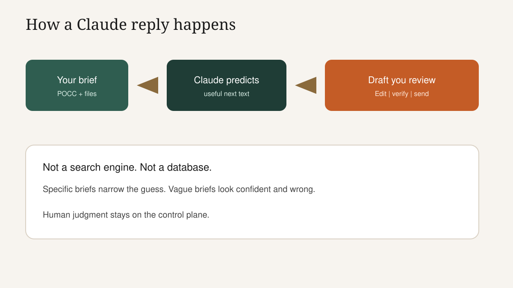
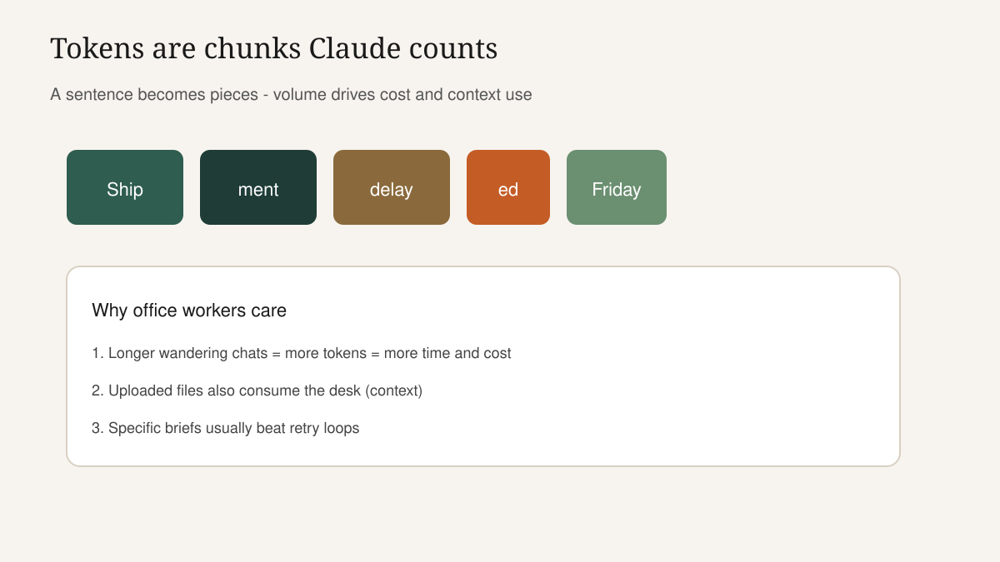
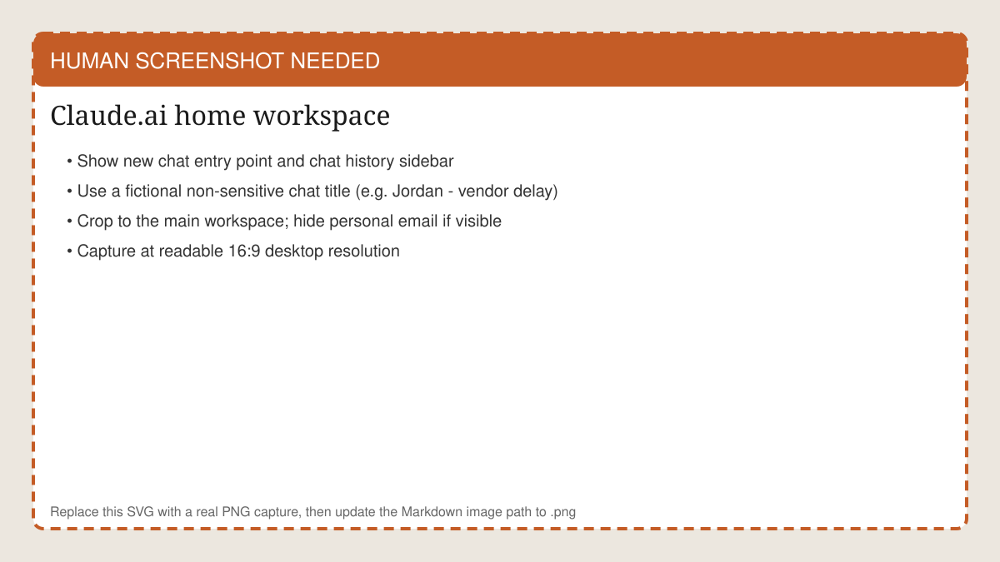
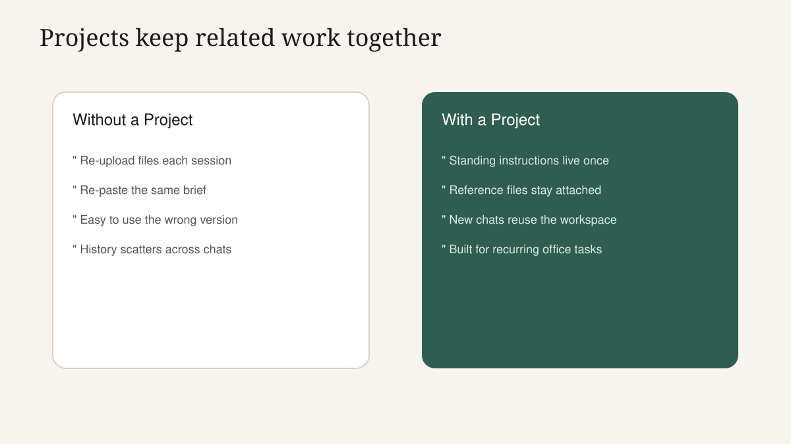
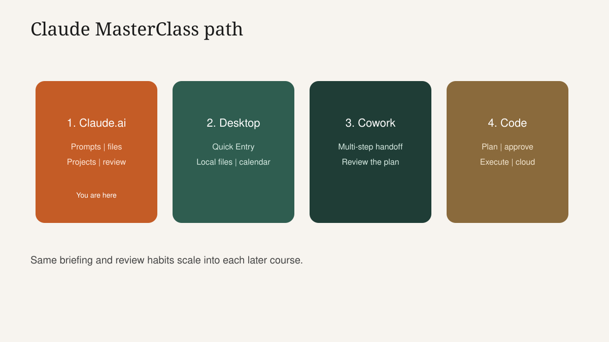

<!-- course-title: Claude.ai Essentials -->

<!-- layout: title -->


Claude.ai Essentials

# Chapter 1: From Chat Box to Clear Prompts

---

# Chapter 1: Objectives

- Explain tokens, context and why specific prompts save time and cost
- Navigate Claude.ai chat, Projects, uploads and chat history with confidence
- Rewrite a vague office request into a reusable POCC prompt

---

<!-- layout: navigation -->
# Chapter 1

- **How Generative AI Actually Works**
- Meet Claude.ai
- Prompting That Actually Works

---

# Meet Jordan (Our Running Example)

- Jordan is an operations coordinator at a mid-size company
- Typical week: vendor delay emails, meeting notes, a Friday status pack for their manager
- Jordan is smart and busy - not a programmer, not an AI hobbyist
- We will solve Jordan's jobs today; map them to your real work in the lab

> [!NOTE]
> Keep Jordan on the whiteboard or a sticky. Every demo should answer "what would Jordan do?"

---

# What "Good" Looks Like by 12:00

- Three prompts Jordan (and you) would actually reuse: email, summary, meeting recap
- Enough interface fluency to find chats, uploads and Projects without hunting
- A plain-language feel for why vague asks waste time - and how to stop
- One personal task bookmarked for the afternoon deliverable chain

---

# Claude Is a Drafter, Not a Truth Machine

- Claude predicts useful next text from patterns in language
- It is not a company database and not a search engine with guaranteed citations
- Your job is to brief it like a capable colleague and verify anything that binds the business
- Fluent wrong answers are the hazard - not blank stares



---

# The Office Analogy That Sticks

- Imagine a fast junior analyst who has read a lot - but was not in your meeting
- If you say "handle the vendor thing," they invent a polished story
- If you say who you are, what happened, what you can offer, and what not to promise - they draft something editable
- Claude behaves the same way; specificity is the brief, not a "prompt trick"

<!-- ANTIGRAVITY / NANO BANANA
Filename: images/ch01-office-analogy.png (replace the SVG placeholder)
Slide: The Office Analogy That Sticks
Prompt advice:
- Scene: professional briefing a capable junior colleague at a clean office desk
- Contrast cue: one sticky note says vague "handle the vendor thing"; a second card shows a clear brief (role, goal, facts, limits)
- Mood: warm, credible corporate training illustration - not cartoon slapstick, not dark dystopia
- Composition: 16:9, subject-readable from the back of a classroom, minimal text in-image
- Avoid: Claude logos, fake UI screenshots, readable real employee names
-->


---

# Tokens in Plain English

- Claude reads and writes in tokens - small chunks of text (often pieces of words)
- Longer prompts, longer replies, and uploaded files all consume tokens
- Providers meter usage by token volume; wandering retries cost money and calendar time
- You do not need to count tokens - you need to stop burning them on clarification loops



---

<!-- layout: 2-column -->
# A Cost You Can Feel

### Vague path (15 minutes)
- "Write something about the delay"
- Three follow-ups to fix tone and facts
- Still not sendable

### Clear path (4 minutes)
- One POCC brief
- One light edit
- Ready for human send

<!-- below-columns -->

> [!TIP]
> Run a stopwatch on the live vague-versus-structured demo. Time is more persuasive than theory.

---

# Context Window = The Desk in Front of Claude

- Everything in the current chat sits on Claude's temporary desk: your messages, replies, file text
- When the desk fills, older details can fall out of reach - quality gets weird or forgetful
- One endless mega-chat about five unrelated jobs is how desks overflow
- Projects and fresh chats are how professionals keep the desk clean


---

<!-- layout: 2-column -->
# When to Start a New Chat

### Keep going in this chat
- Same deliverable, next revision
- Same source files, deeper questions
- Same audience and constraints

### Start a new chat
- New goal or new audience
- Unrelated topic (email vs forecast)
- The thread feels muddy or contradictory

---

# Why Meaning "Nearness" Matters (Lightly)

- Claude connects related ideas even when wording differs ("ship slip" and "delivery delay")
- That helps - and it also means vague asks activate too many nearby meanings
- Fix "off topic" replies with concrete nouns: system names, dates, audience, format
- Skip the math; keep the habit: name the thing

> [!IMPORTANT]
> If Claude drifts, do not argue with it for five turns. Restate the objective and constraints in one clean message.

---

# Where Claude Fits Beside Copilot and Friends

- Many teams already have Microsoft Copilot inside Word, Outlook or Teams
- Copilot wins for light help inside those apps; Claude.ai wins for careful multi-file briefs and reusable Projects
- Policy decides what is allowed - technique cannot override a ban
- Claude Desktop can put the same assistant beside those apps when your work lives outside the browser

---

<!-- layout: navigation -->
# Chapter 1

- How Generative AI Actually Works
- **Meet Claude.ai**
- Prompting That Actually Works

---

# Tour: The Four Places You Live

- **New chat**: blank brief for a new job
- **History**: reopen yesterday's work instead of starting over
- **Uploads**: give Claude the source text for grounded answers
- **Settings / privacy**: know what your seat and org allow before you paste sensitive text

<!-- HUMAN SCREENSHOT: Replace images/ch01-claude-ai-workspace.svg with a real PNG of the Claude.ai home workspace (new chat + history). Fictional chat titles only. Then point Markdown at the .png. -->


---

# Demo: 90-Second Orientation

- Create a chat named `Jordan - vendor delay email`
- Paste a one-line ask, send, then show how to rename and find it in history
- Upload a tiny sample PDF (or paste a short policy paragraph) and ask one question that requires it
- Point at privacy/account settings without doom-scrolling - just "know this exists"

> [!NOTE]
> Use non-sensitive sample files prepared before class. Never demo with a real customer contract.

---

# Chat Hygiene That Saves Friday-You

- Name chats by outcome: `Fri status pack`, not `Chat 12`
- One primary job per chat; fork a new chat when the goal changes
- After a win, copy the prompt into a personal template note
- Archive or ignore dead ends - do not keep "teaching" a confused thread

---

# Projects: Recurring Work Gets a Home

- A Project holds standing instructions plus reference files for a repeating job
- Jordan's candidates: vendor comms standards, weekly status sources, onboarding FAQ
- New chats inside the Project reuse that context - no Monday re-upload ritual
- Update files when the source of truth changes; stale Projects create confident wrong digests



---

<!-- layout: 2-column -->
# Chat versus Project: Decision Rule

### Use a regular chat when
- One-off ask
- No standing files
- Exploring wording only

### Use a Project when
- Weekly or monthly repeat
- Same reference pack
- Same tone and constraints

---

<!-- layout: 2-column -->
# "Don't We Already Have Copilot?"

### Fair answer
- Yes for light in-app help
- Stay there when the work is already open in Microsoft 365
- Use your company's approved default first

### When Claude.ai earns the seat
- Multi-file briefing and synthesis
- Careful rewrites with hard constraints
- A Project you return to every week

---

# Where Claude Fits in the Product Family

- **Claude.ai**: chat, Projects, uploads and everyday drafting
- **Claude Desktop**: Quick Entry and local extensions beside your apps
- **Claude Cowork**: multi-step handoff with plan-then-approve
- **Claude Code**: plan-approve-execute for engineering changes



---

<!-- layout: navigation -->
# Chapter 1

- How Generative AI Actually Works
- Meet Claude.ai
- **Prompting That Actually Works**

---

# Live Contrast: Same Job, Two Briefs

- Job: tell Acme Ops that order 4821 ships one week late
- **Vague**: "Help with the customer email about the delay"
- **Structured**: role, goal, facts, tone, length, must-nots
- send both. Leave both answers on screen. Ask the room which they would sign.

> [!IMPORTANT]
> Do not skip the side-by-side. This is the chapter's "aha" moment.

---

# POCC: Brief Claude Like a Colleague

- **Persona**: who is speaking (role + tone)
- **Objective**: the deliverable and what "done" looks like
- **Context**: facts, audience, sources, background
- **Constraints**: length, format, must-include, must-avoid


---

# What Each Letter Prevents

- Weak **Persona** → generic corporate mush or the wrong authority level
- Weak **Objective** → essay when you needed five bullets
- Weak **Context** → invented dates, names and "helpful" details
- Weak **Constraints** → discounts offered, blame assigned, secrets repeated

---

# Worked Example: Vendor Delay Email

```text
Persona: You are a customer success lead. Tone: calm, accountable, plain language.
Objective: Draft a 150-word email about a one-week ship delay and propose a call.
Context: Order 4821; customer Acme Ops; cause is a part shortage; new ship date this Friday.
Constraints: No discounts. Do not name vendors. Do not apologize more than once.
End with Tue 10:00 or Wed 14:00 call options.
```

- First reply should be editable - not perfect
- Human checks: date, order ID, offers, tone
- Save the shell as a template; swap Context next time

---

# Worked Example: Document Summary

```text
Persona: You are an operations analyst preparing a brief for a busy manager.
Objective: Produce a one-page bullet brief from the uploaded notes.
Include: decisions, owners, dates, open questions, conflicts between sources.
Constraints: No new recommendations. Label contested facts with the source name.
Audience: Jordan's manager, five-minute read.
```

---

# Worked Example: Meeting Recap

```text
Persona: You are the meeting organizer writing a recap people will actually read.
Objective: Turn rough notes into a recap with decisions, action items and owners.
Context: [paste notes]. Meeting: Weekly ops sync. Date: [today].
Constraints: Action items must have an owner and a due date - or mark "owner TBD".
No fluff. Max 200 words before the action table.
```

---

# Steal These Iteration Moves

- **Tighten**: "Cut 30%. Keep every date, name and number."
- **Audience shift**: "Same facts; rewrite for an executive skim."
- **Risk pass**: "List anything that could be wrong or unverified."
- **Format pass**: "Convert the action items to a markdown table."

> [!TIP]
> Iterate with a single instruction per turn. "Make it better" teaches Claude nothing.

---

# Anti-Patterns That Waste the Morning

- One mega-prompt that asks for email + summary + chart + strategy
- Pasting confidential text "just to see," then forwarding the draft
- Arguing with a bad thread instead of starting clean with a better brief
- Shipping the first fluent answer because it "sounds right"

---

# Lab Briefing: What You Will Build

- Three scenarios: client email, document summary, meeting recap
- For each: write a vague first ask, then a POCC rewrite, compare outputs
- Checkpoint: three saved prompts you would reuse within seven days
- Use Jordan's examples if your real work data cannot enter the classroom

---

# Lab 1: Prompt Writing Mastery

**Time:** 30 minutes

---

# What You Learned

- Explained tokens, context and why specific prompts save time and cost
- Navigated Claude.ai chat, Projects, uploads and chat history with confidence
- Rewrote a vague office request into a reusable POCC prompt

---

# Quiz 1 of 3

**Why do specific prompts usually cost less time and money than vague ones?**

- A. Specific prompts always use more tokens, which providers reward with free retries
- B. Vague prompts force more follow-up turns, so total tokens and calendar time rise
- C. Token billing only applies to uploaded files, never to chat text
- D. Claude ignores vague prompts, so you are not charged until the prompt is perfect

---

# Quiz 1: Answer

**Why do specific prompts usually cost less time and money than vague ones?**

**Correct: B.** Vague prompts force more follow-up turns, so total tokens and calendar time rise

- Tokens meter the whole thread, not only the first message
- Clarification loops burn time and budget
- A clear first brief often yields an editable draft on turn one
- Efficiency is an office habit, not only a billing curiosity

---

# Quiz 2 of 3

**Jordan runs the same Friday status pack every week. What should they set up?**

- A. A new blank chat every Friday with no saved instructions
- B. A Project with standing instructions and the recurring reference files
- C. One endless chat that also holds vendor disputes and HR questions
- D. Copilot only, because Projects cannot hold documents

---

# Quiz 2: Answer

**Jordan runs the same Friday status pack every week. What should they set up?**

**Correct: B.** A Project with standing instructions and the recurring reference files

- Recurring work is the Project sweet spot
- Standing constraints keep tone and format stable
- Refresh files when sources change
- Still review outputs before the pack goes to a manager

---

<!-- layout: 2-column -->
# Quiz 3 of 3: Discussion

### Prompt
A colleague pastes "rewrite this nicer" under a long client email and hits send on Claude's first draft.

### Discuss
- Which POCC pieces were missing?
- What business risk is most likely?
- What minimum brief would you require?

---

<!-- layout: 2-column -->
# Quiz 3: Discussion Points

**A colleague pastes "rewrite this nicer" under a long client email and hits send on Claude's first draft.**

### Strong Answers Mention
- Missing Persona, Objective detail, Context facts and Constraints
- Risk of wrong promises, tone, or leftover confidential asides
- Require audience, must-keep facts, must-avoid lines, and a human read

### Watch For
- "Claude will figure it out"
- Tone-only edits that leave factual landmines
- Shipping because the draft sounded professional

---

<!-- layout: stacked -->
# Questions and Answers


