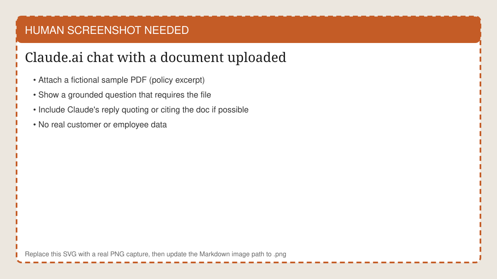
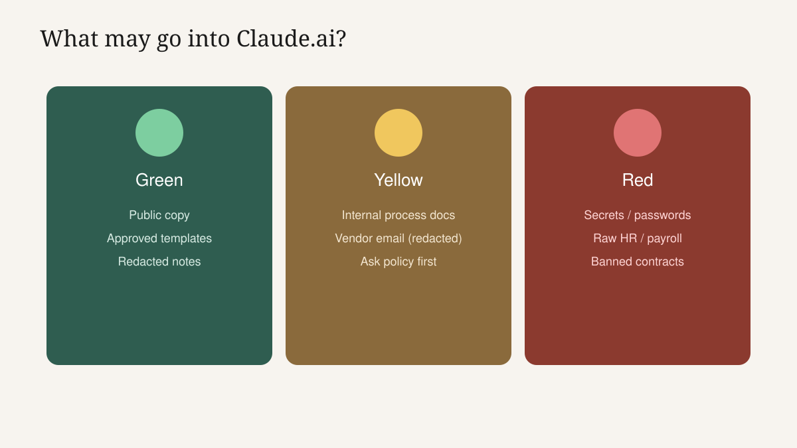
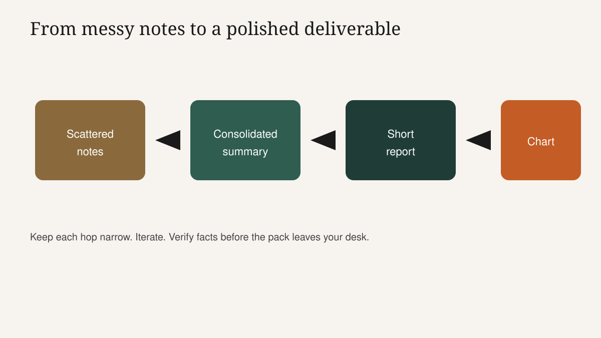
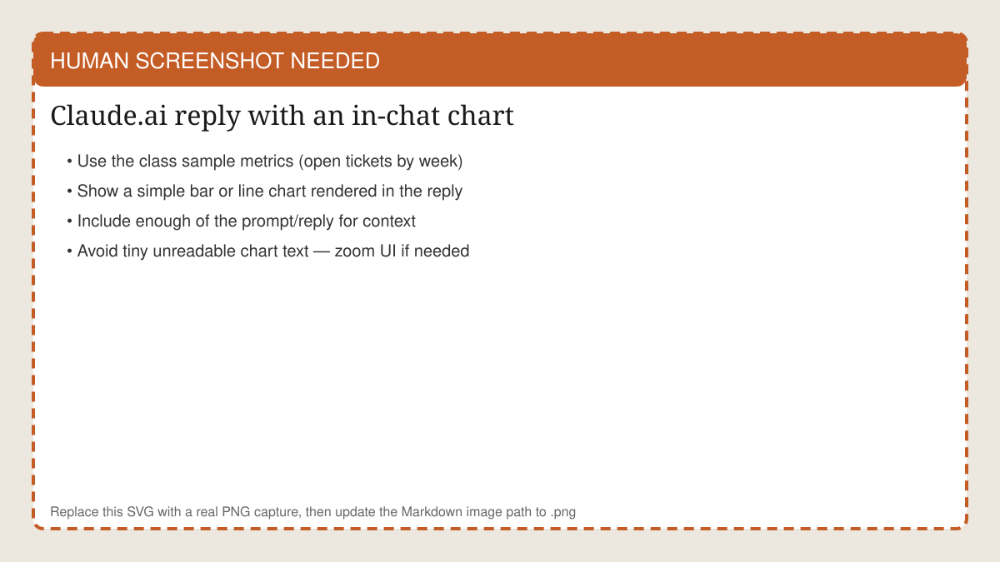

<!-- course-title: Claude.ai Essentials -->

<!-- layout: title -->


Claude.ai Essentials

# Chapter 2: Documents, Deliverables and Trust

---

# Chapter 2: Objectives

- Upload office documents and ask grounded questions without re-briefing every chat
- Turn scattered notes into a short report and a first-look chart through iteration
- Apply data-handling guardrails and catch plausible-but-wrong answers before they travel

---

<!-- layout: navigation -->
# Chapter 2

- **Working with Files and Data Safely**
- From Messy Notes to a Polished Deliverable
- Trust, Data and Guardrails

---

# Jordan's Friday Problem

- Three messy inputs: email thread snippets, meeting notes, a small metrics export
- Manager wants a one-page status plus a simple chart by 3:00
- Doing it by hand means copy-paste archaeology and a blank page
- Today we build the chain: ground → summarize → report → chart → check

> [!NOTE]
> Prep a tiny sample pack before class (3 short text files or one PDF + CSV). Keep it fictional and boring on purpose.

<!-- ANTIGRAVITY / NANO BANANA
Filename: images/ch01-jordan-friday.png (replace the SVG placeholder)
Slide: Jordan's Friday Problem
Prompt advice:
- Ops coordinator at a desk near end of day, clock suggesting late afternoon
- Visual clutter: sticky notes, inbox, spreadsheet glimpse - busy professional, not slapstick chaos
- Tone: relatable ROI classroom hero; warm lighting; 16:9
- Avoid: readable confidential text, real logos, uncanny faces
-->


---

# Grounded Questions Beat Clever Guesses

- Upload the source, then ask questions the file must answer
- Bad: "What is our refund policy in general?" (Claude may invent a plausible policy)
- Good: "According to the uploaded policy, what is the refund window for hardware?"
- Require a quote or section reference before you reuse the answer

<!-- HUMAN SCREENSHOT: Replace images/ch02-file-upload.svg with a real PNG - Claude.ai chat with a fictional policy PDF uploaded and a grounded question visible. -->


---

<!-- layout: 2-column -->
# Demo Pair: Invented versus Quoted

### Ungrounded ask
- No file attached
- "What does our travel policy allow for hotels?"
- Sounds official; may be fiction

### Grounded ask
- Policy PDF attached
- "Quote the hotel cap and the section title."
- Editable only after the quote matches

---

# Redact Before You Upload

- Strip or mask: personal emails, phone numbers, account IDs, salary, health notes
- Replace real customer names with Acme / Contoso in classroom packs
- If policy forbids the document class, do not upload - summarize allowed facts by hand instead
- "I will delete the chat later" is not a control

> [!WARNING]
> Drafts escape. Assume anything you upload could be screenshotted or forwarded.

---

<!-- layout: title-image -->
# Traffic Light: What May Go In?



---

# Traffic Light: Classroom Call-outs

- **Green**: still follow org policy - "usually OK" is not a blank check
- **Yellow**: ask security or your manager before uploading
- **Red**: stop; summarize allowed facts by hand instead of uploading
- When unsure, treat it as yellow or red - never green by hope

---

# Projects for the Weekly Pack

- Put Jordan's standing brief in a Project: audience, tone, section order, chart rules
- Attach the recurring reference files once; refresh when sources change
- Start each Friday chat inside that Project
- Name it for the outcome: `Weekly ops status pack`

> [!TIP]
> Add one Project instruction: "If sources conflict, list both - do not silently pick a winner."

---

<!-- layout: navigation -->
# Chapter 2

- Working with Files and Data Safely
- **From Messy Notes to a Polished Deliverable**
- Trust, Data and Guardrails

---

# The Deliverable Chain (Teach This Shape)

- Scattered notes → consolidated summary → short report → optional chart
- One narrow POCC brief per hop - not one mega-prompt
- Pause after each hop: what improved, what still needs a human
- This is the skill students remember on Monday



---

# Sample Inputs (Read These Aloud)

- **Notes A**: "Acme delay discussed; new date Friday?; Sam owns vendor chase"
- **Notes B**: "Ship date confirmed Friday. No discount. Call offered Tue/Wed."
- **Metrics**: Week 1: 12 open tickets. Week 2: 9. Week 3: 7. Week 4: 8.
- Notice the conflict risk on the Acme date until Notes B confirms it

---

# Step 1 Prompt: Consolidate

```text
Persona: Operations analyst briefing a manager.
Objective: One bullet brief from the three sources.
Include: decisions, owners, dates, open questions, conflicts.
Constraints: No recommendations. Label conflicts with source names.
Sources: Notes A, Notes B, Metrics export.
```

- Good output flags the Acme date uncertainty until resolved
- Bad output quietly "decides" Friday without labeling the conflict

---

# Step 2 Prompt: Promote to a Report

```text
Objective: Turn the bullet brief into a half-page status for Jordan's manager.
Sections: Highlights · Risks · Asks.
Constraints: 180 words max. Keep every date and owner. No new metrics.
Tone: Direct, no hype.
```

- Then iterate: "Cut hedges. Keep numbers. Make Asks a bulleted list."
- Human owns any recommendation that commits the team

---

# Step 3 Prompt: First-Look Chart

```text
Objective: Create a simple bar chart of open tickets by week from the metrics source.
Label weeks 1-4. Title: Open tickets (last 4 weeks).
Constraints: Use only the provided numbers. Do not forecast week 5.
Add one sentence caption that does not overclaim a trend.
```

- Verify bars against the spreadsheet by eye before the pack leaves
- Charts persuade - wrong charts persuade dangerously

<!-- HUMAN SCREENSHOT: Replace images/ch02-chart-in-chat.svg with a real PNG of Claude.ai rendering a simple bar/line chart from the class sample metrics. -->


---

# Demo Script (End to End)

1. Upload the three sample sources in one Project chat
2. Run Step 1; highlight the conflict-handling line
3. Run Step 2; show a tighten pass
4. Run Step 3; spot-check the bars together as a class
5. Ask: "What would you still verify before sending to a manager?"

> [!IMPORTANT]
> Narrate your POCC out loud. Students should hear the brief, not only see the magic output.

---

# When the Chain Breaks (And How to Recover)

- **Muddy summary** → restart Step 1 with stricter "conflicts" language
- **Report invents a metric** → "Remove any number not in the sources"
- **Chart looks dramatic but wrong** → paste the raw table again and regenerate
- **Thread is a mess** → new chat inside the same Project with the winning brief

---

<!-- layout: navigation -->
# Chapter 2

- Working with Files and Data Safely
- From Messy Notes to a Polished Deliverable
- **Trust, Data and Guardrails**

---

# Where Does Our Data Go? (Teach Honestly)

- Answer with plan-tier facts and org policy - not folklore
- Consumer, Pro and commercial or team plans can differ on retention and training defaults
- Uploads, Projects and connectors expand what sits in scope for a chat
- Point to official Anthropic docs live if possible; say "policies change"

> [!IMPORTANT]
> State which plan the classroom seats use. Ambiguity here erodes trust for the rest of the day.

---

# Plausible but Wrong: The Real Enemy

- Dangerous answers are fluent, specific and slightly false
- Favorites: invented policy clauses, wrong dates, fake "according to the document" lines, helpful refunds
- Anything that commits money, legal language, compliance or customer promises gets a source check
- Tone is not evidence

<!-- ANTIGRAVITY / NANO BANANA
Filename: images/ch02-plausible-wrong.png (replace the SVG placeholder)
Slide: Plausible but Wrong: The Real Enemy
Prompt advice:
- Editorial illustration of a polished business document with one subtle crack / red error mark
- Metaphor: fluency hiding a factual flaw - serious training poster, not horror
- 16:9, limited text in-image (optional tiny "sounds right" vs "is right")
- Avoid: fake Claude UI, real company marks, grotesque imagery
-->


---

# Drill: Spot the Landmine

- Claude writes: "Per our policy, Acme is entitled to a 10% credit for the delay."
- Notes B said: no discount. No policy file promised a credit.
- Class call-out: which checklist item failed?
- Fix: "Remove any offer not present in the sources. Quote the source for commitments."

---

<!-- layout: 2-column -->
# 60-Second Send Checklist

### Check before you send
- Hard facts appear in a source
- Names, dates and figures match
- No unauthorized promises

### Stop and revise if
- Citation is missing
- Sources conflicted and Claude picked
- You would not sign it yourself

---

# Ownership Stays Human

- Nothing happens without a prompt in this web workflow
- Claude does not send the email, update the CRM or approve the refund
- "Claude decided" really means "someone accepted a draft"
- Desktop, Cowork and Code add power later - with more review, not less responsibility

---

# Lab 2 Preview

- Fact-Checking and Grounding AI Output extends today's drill
- Practice planting and finding errors in a safe sample pack
- Build your own checklist for your role (ops, finance, HR, client-facing)
- Capture one lesson learned you can share with your team - patterns only, not sensitive data

---

# Lab 2: Fact-Checking and Grounding

**Time:** 30 minutes

---

# What You Learned

- Uploaded office documents and asked grounded questions without re-briefing every chat
- Turned scattered notes into a short report and a first-look chart through iteration
- Applied data-handling guardrails and practiced catching plausible-but-wrong answers

---

# Quiz 1 of 3

**You need a weekly digest from the same three reference PDFs. What is the best Claude.ai habit?**

- A. Paste the full PDFs into a new chat every Monday and delete history afterward
- B. Keep the files and standing instructions in a Project and start each digest chat there
- C. Upload the PDFs once to any random chat and never open Projects
- D. Ask Claude to invent the digest from memory so files never leave your machine

---

# Quiz 1: Answer

**You need a weekly digest from the same three reference PDFs. What is the best Claude.ai habit?**

**Correct: B.** Keep the files and standing instructions in a Project and start each digest chat there

- Projects cut re-upload and re-brief friction
- Standing instructions stabilize format and constraints
- Refresh files when the source of truth changes
- Org policy still governs what may be uploaded

---

# Quiz 2 of 3

**Which output is the highest priority for a human fact check?**

- A. A synonym suggestion for a subject line
- B. A customer email that states a new delivery date and partial refund
- C. A rewrite that only shortens sentences without changing facts
- D. A list of optional section headings for an internal outline

---

# Quiz 2: Answer

**Which output is the highest priority for a human fact check?**

**Correct: B.** A customer email that states a new delivery date and partial refund

- Commitments, money and dates bind the business
- Fluency is not verification
- Low-stakes wording still deserves a skim - commitments come first
- Require a source quote when unsure

---

<!-- layout: 2-column -->
# Quiz 3 of 3: Discussion

### Prompt
Claude turns Jordan's three sources into a manager report with a chart that "proves tickets are trending down."

### Discuss
- Where could plausible-but-wrong hide?
- What would you verify in five minutes?
- When would you refuse to upload a source?

---

<!-- layout: 2-column -->
# Quiz 3: Discussion Points

**Claude turns Jordan's three sources into a manager report with a chart that "proves tickets are trending down."**

### Strong Answers Mention
- Week-4 uptick, conflicted dates, overclaimed trend language
- Spot-check figures; confirm owners; tone down causal claims
- Refuse banned document classes and raw personal data

### Watch For
- "The chart looks professional, so the story is true"
- Silent resolution of source conflicts
- Uploading everything because a Project "feels private"

---

<!-- layout: stacked -->
# Questions and Answers


