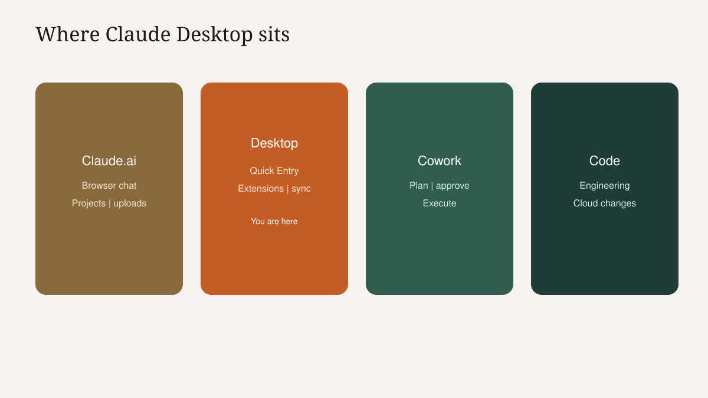

<!-- course-title: Claude Desktop Essentials -->

<!-- layout: title -->

Claude Desktop Essentials

# Chapter 1: Claude on Your Desktop

---

# Chapter 1: Objectives

- Explain what changes—and what stays the same—when moving from Claude.ai to Claude Desktop
- Use Quick Entry to reach Claude from inside another app without losing focus
- Install and configure a Desktop Extension that connects Claude to local files or calendar data

---

<!-- layout: navigation -->
# Chapter 1

- **Why Desktop?**
- Quick Entry, Sessions and Sync
- Desktop Extensions

---

# Jordan Is Back—And Stuck in Windows

- Same Jordan from Course 1: ops coordinator, vendor emails, Friday status pack
- New pain: the work lives in Outlook, Excel and a local folder—not in a browser tab
- Every Claude.ai hop costs focus: find the chat, paste context, wait, paste back
- Today we remove that tax with Quick Entry, sync and one carefully scoped extension

> [!NOTE]
> Course 1 skills still apply: POCC briefs, Projects, human review. Desktop changes where you launch them.

---

# Creative Warm-Up (2 Minutes, Max)

- Instructors: ask Claude Desktop something playful (haiku about inbox zero, rename a fake project, silly subject lines)
- Point: the same assistant feels more reachable when it is already on the desktop
- Land the beat: availability drives adoption more than feature lists
- Then switch to Jordan's real friction—do not linger in party-trick mode

---

# Same Claude, Different Surface

- Model quality and account are continuous with Claude.ai
- What changes: Quick Entry, Desktop Extensions, living beside local apps
- What stays: clear briefs, Projects (synced), verify-before-send
- Cowork and Code remain later courses—preview only today

---

# The Tab-Switching Tax (Make It Numeric)

- Assume 8 Claude asks per day × 90 seconds of switching and re-orienting = 12 minutes
- That is an hour a week before you count bad briefs caused by lost context
- People cope by shortening the ask—quality drops, retries rise
- Desktop attacks the switching cost so you can spend attention on the brief

---

<!-- layout: 2-column -->
# Browser Habit versus Desktop Habit

### Browser-only
- Alt-tab to Claude.ai
- Hunt the right chat
- Paste a partial brief
- Copy back into Outlook

### Desktop + Quick Entry
- Stay in Outlook
- Hotkey Claude in place
- Brief with the email still visible
- Paste the draft once

---

# Install Check Before We Go Deep

- Claude Desktop installed, signed in, same account as Course 1
- A Course 1 chat or Project is visible via sync
- Students can open Settings and see Extensions
- Blockers go to the parking lot now—not during the lab

> [!IMPORTANT]
> No admin rights and no pre-approved extension means no lab. Confirm IT path before class.

---

<!-- layout: 2-column -->
# When Desktop Wins vs Browser

### Prefer Desktop when
- You are mid-email or mid-sheet
- You need a local folder or calendar
- You want a keystroke habit

### Prefer Claude.ai when
- You are already researching in the browser
- IT has not approved Desktop yet
- You only need a quick web upload

---

<!-- layout: navigation -->
# Chapter 1

- Why Desktop?
- **Quick Entry, Sessions and Sync**
- Desktop Extensions

---

# Quick Entry: The Whole Game

- A hotkey summons Claude without leaving the app you are in
- Best used at the moment of need: reply, rewrite, extract, schedule check
- Weak use: summoning Claude with no brief ("uh, help")
- Strong use: hotkey + short POCC while the source is still on screen

<!-- TODO IMAGE: Screenshot of Claude Desktop Quick Entry overlay appearing over an email or spreadsheet window -->

---

# Instructor Demo: Outlook-Style Rewrite

1. Open a sample vendor-delay email (fictional)
2. Hit Quick Entry without leaving the mail client
3. Paste a tight POCC (reuse Course 1 vendor email shell)
4. Drop the draft back into the reply window
5. Ask the room: what did we not have to retype?

> [!TIP]
> If live Outlook is painful in the classroom, use Notepad or Word with the same choreography—the lesson is focus, not the mail brand.

---

# Configure a Shortcut You Will Keep

- Open Desktop settings → Quick Entry shortcut
- Avoid chords stolen by Zoom, Teams, Excel or the OS
- Test from two apps; write the chord on a sticky
- Agree as a class: change it once, then stop fiddling

---

# Session Hygiene on the Desktop

- Separate sessions for separate jobs—same rule as Course 1 chats
- Name threads by outcome: `Acme delay reply`, `Fri pack`
- Quick Entry should land you somewhere intentional, not in last week's chaos
- Close finished work so the default session stays clean

---

<!-- layout: 2-column -->
# Multi-Session Patterns

### Good split
- Session A: customer email
- Session B: status pack
- Session C: calendar prep

### Bad mash-up
- One session for everything
- Context bleeds across jobs
- Constraints from email hit the report

---

# Sync: Finish What You Started on the Web

- Morning: sketch a brief in Claude.ai on a laptop in a meeting
- Afternoon: continue the same thread in Desktop beside Excel
- Sync is continuity of conversations and Projects—not shared local disk access
- Missing thread? Check account, network, then refresh—before rewriting from scratch

<!-- TODO IMAGE: Screenshot pair or single view showing the same conversation available in Claude.ai and Claude Desktop -->

---

<!-- layout: navigation -->
# Chapter 1

- Why Desktop?
- Quick Entry, Sessions and Sync
- **Desktop Extensions**

---

# Extensions = Permissioned Local Superpowers

- A Desktop Extension connects Claude to local capability: files, calendar, other approved tools
- Unlike Course 1 uploads, access can persist for later asks inside the allowed scope
- Unlike Cowork, you still drive each ask—the extension does not run a multi-step agent plan
- Install is an access decision; treat it like provisioning, not like enabling dark mode

---

# Tour the Directory Like a Skeptic

- Settings → Extensions: see what your seat is allowed to install
- Prefer Anthropic-reviewed and admin-allowlisted options
- Read the permission blurb out loud before install
- Pick the smallest extension that kills Jordan's friction point

> [!WARNING]
> Collecting extensions "just in case" is how scope creeps. One good workflow beats five toys.

---

# Live Install Script (Filesystem or Calendar)

1. Choose the classroom-approved extension
2. Scope narrowly: one `ClassDemo/WeeklyStatus` folder—or calendar read-only
3. Ask: "List the file names in my WeeklyStatus folder" or "What is my next meeting today?"
4. Ask a follow-up that needs file contents—no manual upload
5. State what remains out of scope (other drives, mail body, password managers)

<!-- TODO IMAGE: Screenshot of Claude Desktop Extensions settings with a local filesystem or calendar extension enabled -->

---

# Workflow Card: The Lab Deliverable Shape

| Field | Example |
| :--- | :--- |
| Friction | Rewriting vendor emails while in Outlook |
| Trigger | Quick Entry hotkey |
| Extension | Filesystem → `WeeklyStatus` only |
| Brief | POCC vendor-delay template |
| Done when | Draft pasted + human fact check |

- Students fill this card for their own job in the lab
- If they cannot name the friction, they are not ready to pick an extension

---

# Three Starter Workflows (Steal One)

- **Email rewrite**: Quick Entry from mail + no extension required
- **Folder digest**: Quick Entry + filesystem scoped to one project folder
- **Meeting prep**: Quick Entry + calendar read + "prep me for the next 2:00"

> [!NOTE]
> Email-only workflows still count. Not every win needs an extension.

---

# Lab Briefing: Workflow Integration Sprint

- Pick one real friction point (or a Jordan proxy if data is sensitive)
- Install only the approved extension you need—or none
- Configure Quick Entry; document the Workflow Card
- Checkpoint: demo your loop to a neighbor in 60 seconds

---

# Lab 1: Workflow Integration Sprint

**Time:** 30 minutes

---

# What You Learned

- Explained what changes—and what stays the same—when moving from Claude.ai to Claude Desktop
- Used Quick Entry to reach Claude from inside another app without losing focus
- Installed and configured a Desktop Extension that connects Claude to local files or calendar data

---

# Quiz 1 of 3

**What is the main productivity win Claude Desktop adds on top of Claude.ai?**

- A. It replaces Cowork and Code so later courses are optional
- B. It runs fully offline with no account
- C. It cuts tab-switching by putting Claude one keystroke from the app where you already work
- D. It auto-installs every extension without approval

---

# Quiz 1 — Answer

**What is the main productivity win Claude Desktop adds on top of Claude.ai?**

**Correct: C.** It cuts tab-switching by putting Claude one keystroke from the app where you already work

- Capability is continuous with Course 1
- Surface and timing change adoption
- Extensions are optional amplifiers
- Sync keeps browser work available on the desktop

---

# Quiz 2 of 3

**How does a Desktop Extension differ from a Claude.ai file upload?**

- A. Extensions only work in a browser
- B. An extension can connect Claude to authorized local sources without a fresh manual upload each time
- C. Uploads ignore policy while extensions do not
- D. Extensions always exfiltrate the whole disk by design

---

# Quiz 2 — Answer

**How does a Desktop Extension differ from a Claude.ai file upload?**

**Correct: B.** An extension can connect Claude to authorized local sources without a fresh manual upload each time

- Uploads make the file choice explicit each time
- Extensions change the access model—so review matters more
- Scope and allowlists are the controls
- You still invoke Claude; capability is not silent action

---

<!-- layout: 2-column -->
# Quiz 3 of 3 — Discussion

### Prompt
A teammate enables Quick Entry and a whole-home-folder filesystem extension "to be ready for anything."

### Discuss
- What friction are they actually solving?
- What narrower scope would you recommend?
- What must they verify before install?

---

<!-- layout: 2-column -->
# Quiz 3 — Discussion Points

**A teammate enables Quick Entry and a whole-home-folder filesystem extension "to be ready for anything."**

### Strong Answers Mention
- Name one recurring task; size access to that task
- Prefer a project folder over the home directory
- Permissions, allowlist, and credential storage before install

### Watch For
- "More access is always better"
- Skipping the permission summary
- Confusing Extensions with unsupervised Cowork agents

---

<!-- layout: stacked -->
# Questions and Answers

