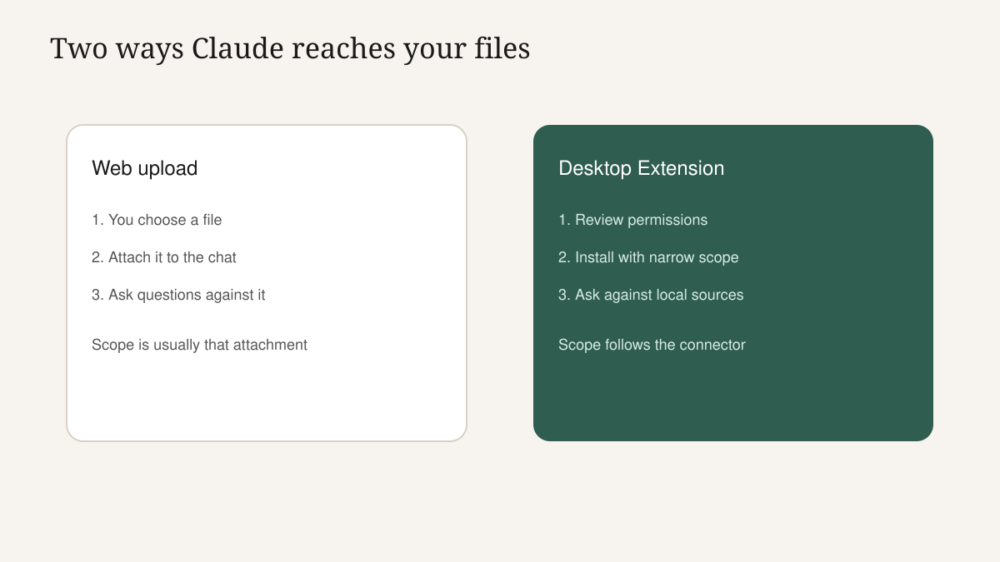
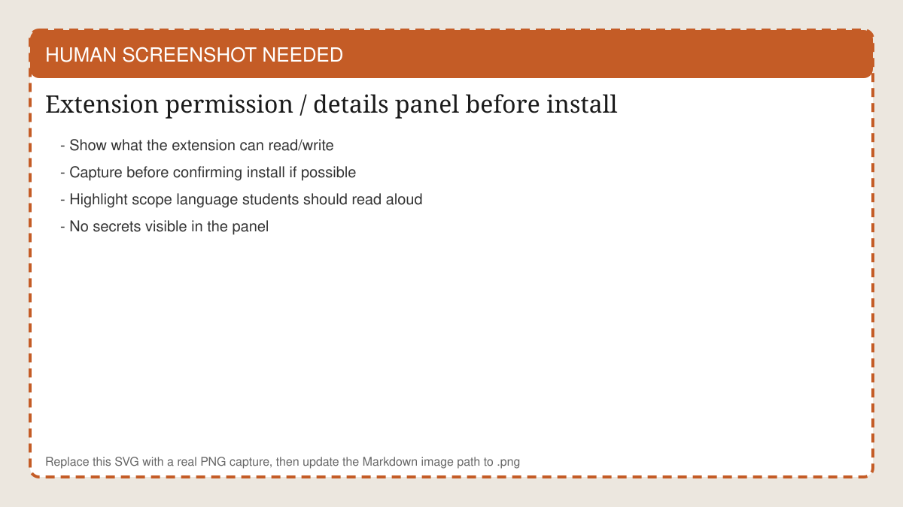
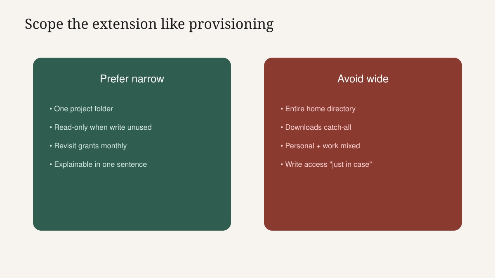
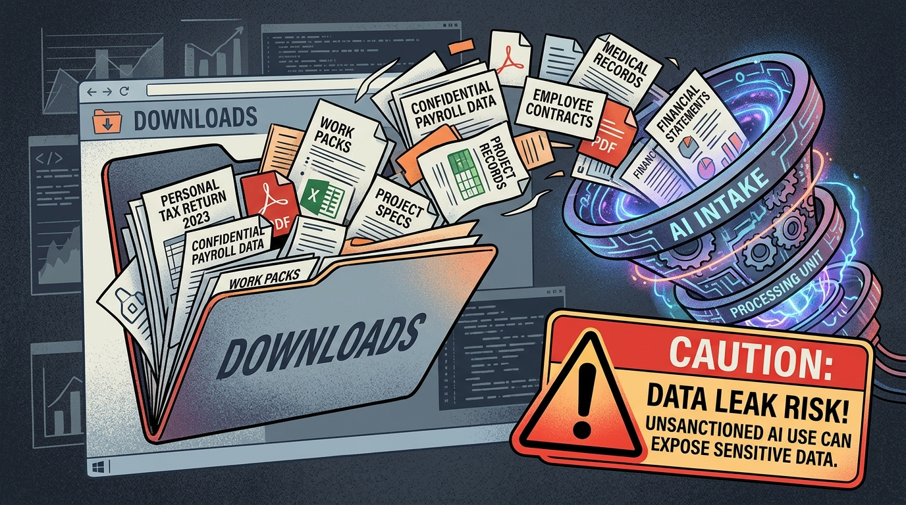

<!-- course-title: Claude Desktop Essentials -->

<!-- layout: title -->

Claude Desktop Essentials

# Chapter 2: Local Access, Guardrails and What's Next

---

# Chapter 2: Objectives

- Compare local-extension risk against Claude.ai web uploads and choose safer scopes
- Apply desktop and enterprise guardrails before trusting an extension in daily work
- Know when Desktop is enough - and when Cowork or Claude Code fits the job better

---

<!-- layout: navigation -->
# Chapter 2

- **What Local Access Changes**
- Trust, Data and Guardrails
- Glimpse Ahead: Cowork and Code

---

# Convenience Changed the Risk Shape

- Web upload: you chose a file; scope was obvious in the moment
- Desktop extension: Claude can answer from authorized local sources later - easy to forget what is in bounds
- Speed is good; invisible scope is not
- Today's job: make scope visible, narrow, and intentional

---

<!-- layout: 2-column -->
# Side-by-Side Risk Story

### Claude.ai upload
- Jordan attaches `status-notes.txt`
- Asks three questions
- Detaches mentally when the chat ends

### Extension (today)
- Jordan grants `WeeklyStatus/` read access
- Next week asks "summarize what's new"
- Must still remember what that folder contains

<!-- below-columns -->

> [!IMPORTANT]
> Ask aloud: "What else lives in that folder?" If the answer is "uh," narrow the scope.

---

# Permission Review Script (Say It With Students)

1. What can it read?
2. What can it write or send?
3. Does access persist after this chat?
4. Is it allowlisted for our tenant?
5. Can I explain the grant in one sentence to security?

<!-- HUMAN SCREENSHOT: Replace images/ch02-permission-review.svg with a real PNG of the extension permission/details panel before install. -->

---

<!-- layout: title-image -->
# Narrow versus Wide Scope

---

# Enterprise Controls Are Features

- Allowlists decide what appears in the directory
- Code signing and reviewed packages reduce mystery installs
- Encrypted credential storage protects tokens tools need
- SSO and managed updates keep Desktop inside the corporate identity story

> [!NOTE]
> Classroom may be looser than production. Send students home with questions for IT - not only a happy lab screenshot.

---

# Capability Is Not Action

- Installed ≠ running
- Claude Desktop still waits for Quick Entry, a send, or an explicit tool use
- If something acts without a prompt, escalate - it is not the mental model for today
- Multi-step autonomy belongs to Cowork's plan-approve-execute loop

---

# Failure Story: The Shared Downloads Folder

- Jordan points the filesystem extension at `Downloads/` because "all the packs land there"
- `Downloads/` also holds personal PDFs, payroll estimates and a customer roster export
- A casual "summarize new files" pull mixes worlds Claude should never blend
- Fix: move work packs to `WeeklyStatus/` and grant only that folder

> [!WARNING]
> Shared catch-all folders are the most common self-inflicted Desktop risk.

<!-- ANTIGRAVITY / NANO BANANA
Filename: images/ch02-downloads-trap.png (replace the SVG placeholder)
Slide: Failure Story: The Shared Downloads Folder
Prompt advice:
- Cautionary editorial illustration: overflowing Downloads folder mixing personal docs, payroll hints, and work packs pouring into an AI funnel
- Tone: serious training warning, not horror or comedy
- 16:9; no readable PII; no real Claude UI chrome
- Optional small caption space: "Catch-all folders are not scopes"
-->

---

<!-- layout: navigation -->
# Chapter 2

- What Local Access Changes
- **Trust, Data and Guardrails**
- Glimpse Ahead: Cowork and Code

---

# How Data Handling Differs (Without Fearmongering)

- Uploads put chosen file bytes into chat context for that work
- Extensions read through a permissioned connector; what enters the thread depends on the ask and tool design
- Retention, logging and training defaults still follow plan tier and org agreement
- Prefer official docs + security guidance over Slack folklore

---

# Minimize What Enters the Thread

- Even with a filesystem grant, do not paste secrets "for convenience"
- Ask Claude to use the file in place when the tool supports it
- Redact locally before any content must be pasted
- Same rule as web chat: assume drafts can escape via screenshot or forward

---

<!-- layout: 3-column -->
# Three Guardrail Questions

### Identity
- Work account signed in?
- SSO required?
- Personal Claude on a work laptop?

### Scope
- Which folders/calendars?
- Read or write?
- Still needed next month?

### Oversight
- Allowlisted?
- Who approves new tools?
- Where is the audit path?

---

<!-- layout: 3-column -->
# Role-Based Watch-outs

### Admin / Ops
- Shared drives
- Customer folders
- Vendor attachments

### Finance / HR
- Payroll and IDs
- Health-adjacent notes
- Offer letters

### Client-facing
- Invented commitments
- Discount language
- Legal-sounding clauses

---

# Desktop Send Checklist

- Run a 60-second fact check before anything leaves your desk
- Plus: "Was this answer influenced by an extension - and was that scope intended?"
- Plus: "Would I be comfortable showing security the folder grant?"
- If either answer is no, stop and reshape access

---

<!-- layout: navigation -->
# Chapter 2

- What Local Access Changes
- Trust, Data and Guardrails
- **Glimpse Ahead: Cowork and Code**

---

# Cowork: When One Keystroke Is Not Enough

- Use Cowork when the job is a chain: gather → summarize → draft → file
- Pattern: **plan → approve → execute**
- You read the plan before the agent acts
- Built for business users who want progress with a checkpoint - not silent automation

---

# Code: When the Change Lives in Engineering

- Repositories, cloud accounts, infrastructure and application changes
- Same discipline family: plan, approve, execute
- Wrong tool for pure office packet work
- Right tool when the next problem is a PR or cloud fix

---

<!-- layout: 2-column -->
# Decision Tree: What Do You Book Next?

### Book Cowork if
- Multiple steps and artifacts
- You want a plan to approve
- Business process ownership

### Book Code if
- Developers own the change
- Repo or cloud account required
- Engineering review culture fits

<!-- below-columns -->

> [!TIP]
> Still drowning in tab-switching on single-step tasks? Stay on Desktop and deepen Quick Entry habits before adding an agent.

---

# Story Beat: Jordan's Next Pain

- Desktop fixed Jordan's "rewrite while in Outlook" loop
- Still painful: Friday pack across five steps and three tools
- That pain is a Cowork trailer - not another extension pile-on
- Engineering teammate asking for help with a cloud script? That is Code

---

# Lab 2 Preview

- Tool Hacking and Exploration: compare one local workflow to a Claude.ai web upload path
- Document permissions, scope and time saved
- Do not install unapproved tools on a work laptop
- Bring questions for your admin - bring curiosity, not shadow IT

---

# Lab 2: Tool Hacking and Exploration

**Time:** 30 minutes (in class)

---

# What You Learned

- Compared local-extension risk against Claude.ai web uploads and chose safer scopes
- Applied desktop and enterprise guardrails before trusting an extension in daily work
- Previewed when Cowork or Claude Code fits better than Desktop alone

---

# Quiz 1 of 3

**Why can a local filesystem extension be riskier than a one-time Claude.ai upload?**

- A. Uploads ignore organization policy while extensions cannot
- B. Extensions may keep broader ongoing access than a single explicit attachment
- C. Filesystem extensions always delete local files after answering
- D. Quick Entry bypasses all extension permissions automatically

---

# Quiz 1: Answer

**Why can a local filesystem extension be riskier than a one-time Claude.ai upload?**

**Correct: B.** Extensions may keep broader ongoing access than a single explicit attachment

- Uploads make the file choice obvious each time
- Persistent connectors need deliberate scope
- Allowlists exist because the risk shape changed
- Invoke still matters - capability is not action

---

# Quiz 2 of 3

**What should you do before installing a Desktop Extension?**

- A. Install first; read permissions only if something breaks
- B. Grant the widest folder scope so you never reconfigure
- C. Review what it can see and do, confirm org approval, and shrink scope to the task
- D. Prefer unsigned sideloads because they are faster

---

# Quiz 2: Answer

**What should you do before installing a Desktop Extension?**

**Correct: C.** Review what it can see and do, confirm org approval, and shrink scope to the task

- Permission literacy is Desktop fluency
- Narrow scope beats speculative access
- Allowlists and signing are there to be used
- Document why you installed it

---

<!-- layout: 2-column -->
# Quiz 3 of 3: Discussion

### Prompt
Jordan's next pain is a five-step weekly packet: gather files, summarize, draft email, attach chart, file the folder.

### Discuss
- Is Quick Entry + an extension enough?
- When do you promote this to Cowork?
- What guardrails travel with either choice?

---

<!-- layout: 2-column -->
# Quiz 3: Discussion Points

**Jordan's next pain is a five-step weekly packet: gather files, summarize, draft email, attach chart, file the folder.**

### Strong Answers Mention
- Desktop speeds hops; Cowork fits the multi-step handoff
- Review a plan before execution when steps chain
- Keep file scope tight; verify before send

### Watch For
- "Extensions will just do the whole packet"
- Skipping approval because step one looked good
- Choosing Code with no repo or cloud change

---

<!-- layout: stacked -->
# Questions and Answers

