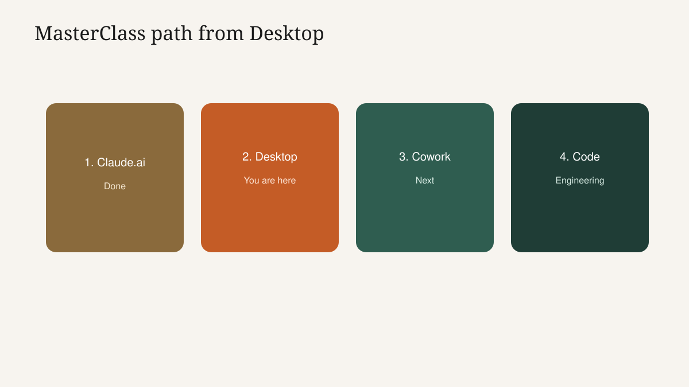

<!-- course-title: Claude Desktop Essentials -->

<!-- layout: title -->

Claude Desktop Essentials

# Chapter 3: Wins, Next Steps and Resources

---

# Chapter 3: Objectives

- Reframe today's skills as time saved from eliminated context-switching
- Name the next friction point to solve with Quick Entry or an extension
- Leave with resources and a clear MasterClass path into Cowork and Code

---

<!-- layout: navigation -->
# Chapter 3

- **Business Wins and ROI**
- Your Next Friction Point
- Resources and Wrap-up

---

# The Win Is Interruptions Avoided

- Quick Entry keeps the brief attached to the moment of need
- A scoped extension removes repeat upload theater
- Guardrails prevent "fast" from becoming an expensive mistake
- Feature tourism without a Workflow Card is not ROI

---

<!-- layout: 2-column -->
# Before versus After Today

### Before
- Leave the app for a browser tab
- Re-paste context every time
- Upload the same folder weekly
- Forget what an extension can see

### After
- Summon Claude in place
- Reuse a documented workflow
- Ask against authorized local scope
- Explain the grant in one sentence

---

# Napkin Math for Desktop

- 8 switches/day × ~90 seconds ≈ 12 minutes/day
- Even cutting that in half returns about 30 minutes/week
- Add quality: better briefs because the source was still on screen
- Students should plug in their own switch count—do not oversell

---

<!-- layout: navigation -->
# Chapter 3

- Business Wins and ROI
- **Your Next Friction Point**
- Resources and Wrap-up

---

# Reflection: Name the Next Fix

- Write one daily friction point for the next seven days
- Choose: Quick Entry only, extension only, or both
- Write the minimum permission you need—and what stays out
- If it is a five-step packet, park it for Cowork instead of piling extensions

> [!NOTE]
> Two quiet minutes, then volunteers share friction points—not file paths.

---

# Update Your Workflow Card

| Field | Your notes |
| :--- | :--- |
| Friction | |
| Trigger (hotkey) | |
| Extension / scope | |
| Brief (POCC shell) | |
| Done when | |

- If you cannot fill the card, the workflow is not ready for production use
- Share cards with a teammate; unclear cards get clearer under questions

---

# Success Looks Like Day 7

- Hotkey works without looking it up
- Extension grant still makes sense (or you removed it)
- You reused the workflow at least twice
- You refused at least one over-broad install impulse

---

<!-- layout: navigation -->
# Chapter 3

- Business Wins and ROI
- Your Next Friction Point
- **Resources and Wrap-up**

---

# How Desktop Builds on Course 1

- Course 1: POCC, Projects, uploads, human review
- Course 2: same judgment, lower friction, permission literacy for local connectors
- Sync means your Projects are not stranded in the browser
- The send checklist gains one question: was this scope intended?

---

# MasterClass Path From Here

- **Next: Claude Cowork Essentials** — multi-step handoff; review the plan before execution
- **Then: Claude Code Essentials** — plan-approve-execute for engineering teams on real cloud accounts
- Book the session that matches the next pain—not the flashiest label

---

# Leave-Behind Resources

- Extensions quick-reference: permissions, scope, install checklist
- Take-home lab: Tool Hacking and Exploration
- Official Claude Desktop documentation
- Your completed Workflow Card from today's sprint

> [!TIP]
> Distribute the quick-reference before packing up begins.

---

# Day Recap

- Desktop is the same Claude beside real apps
- Quick Entry removes the tab-switching tax
- Extensions connect local tools only with deliberate scope
- Invisible scope is the risk; review and allowlists are the cure
- Cowork and Code wait for multi-step handoff and engineering work

---

<!-- layout: stacked -->
# Questions and Answers

