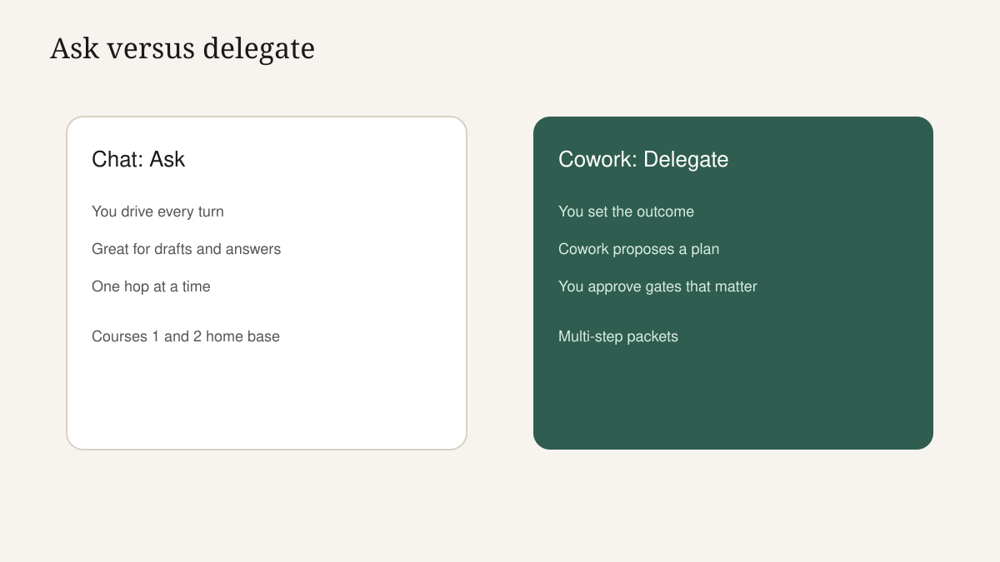
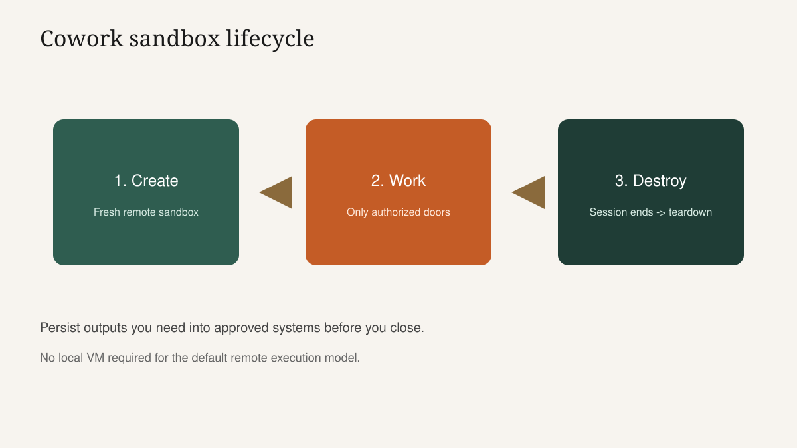
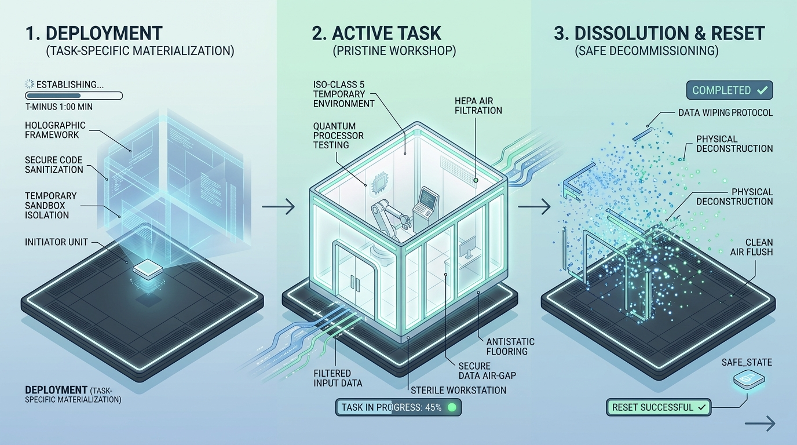
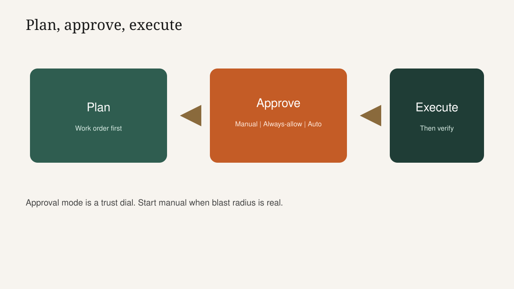
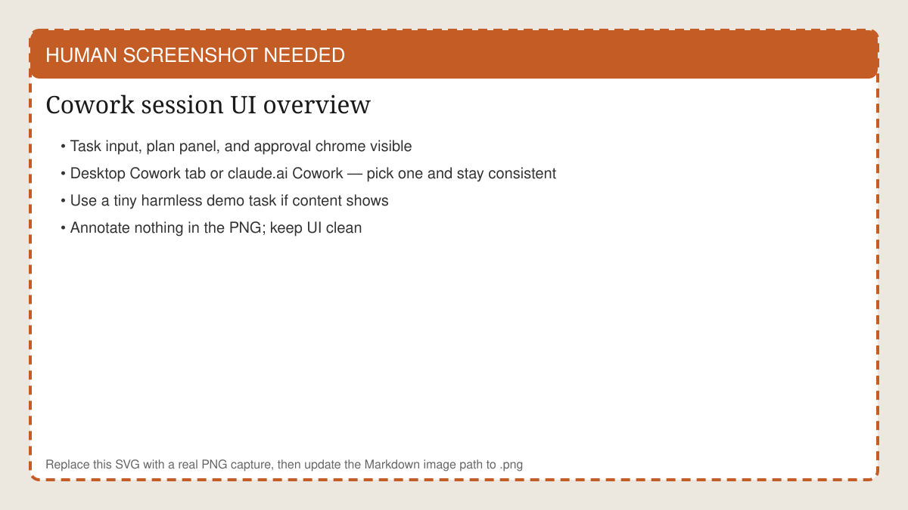
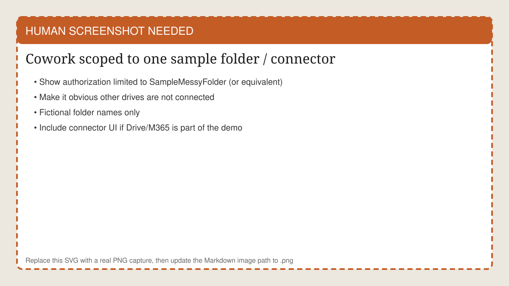
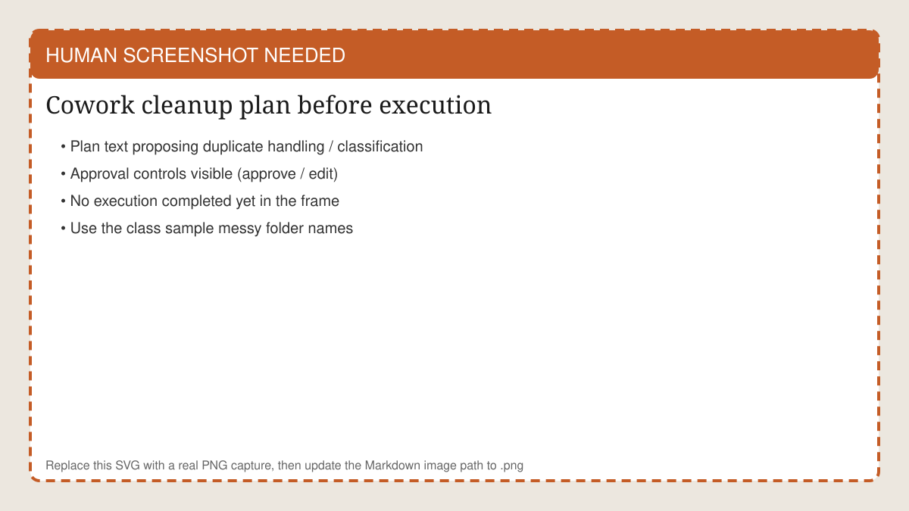

<!-- course-title: Claude Cowork Essentials -->

<!-- layout: title -->


Claude Cowork Essentials

# Chapter 1: From Asking to Delegating

---

# Chapter 1: Objectives

- Explain what changes when you move from asking Claude a question to delegating a multi-step task
- Describe plan → approve → execute and choose among manual, always-allow and auto-approve
- Scope a Cowork session and run Clean and Classify with plan review before execution

---

<!-- layout: navigation -->
# Chapter 1

- **From Assistant to Agent**
- Starting a Cowork Session
- Clean and Classify

---

# Jordan's New Bottleneck

- Course 1: Jordan got great drafts from clear prompts
- Course 2: Jordan reached Claude without tab-switching
- Still stuck: Friday pack is five steps across a messy folder—gather, dedupe, classify, summarize, file
- One clever prompt will not finish that job; a supervised agent might

> [!NOTE]
> MasterClass throughline: **ask** → **reach** → **delegate** → (Course 4) **code**. Today is delegate.

---

# Ask versus Delegate

- **Ask** (Chat): one turn or a short thread; you drive every step
- **Delegate** (Cowork): you state an outcome; Cowork proposes a plan, then acts with approval gates
- You are not "prompting harder"—you are changing the shape of the work
- If you still want to approve wording line by line, stay in Chat



---

<!-- layout: 2-column -->
# When Cowork Earns the Seat

### Good Cowork jobs
- Multi-step with a clear done state
- Folder cleanup and filing
- Research across several sources into one pack
- Recurring packets with the same shape

### Stay in Chat / Desktop
- Single rewrite or summary
- Exploratory brainstorming
- You need to wordsmith every sentence live
- Ambiguous goal you cannot define yet

---

# Sandbox Isolation (The Mental Model)

- Each Cowork session gets a fresh remote sandbox on Anthropic's side
- The sandbox is destroyed when the session ends—treat it as temporary work space
- No reach into your network beyond what you explicitly authorize (folders, connectors)
- Stable internet is required; this is not a local VM or Hyper-V lab

> [!IMPORTANT]
> Remote execution means Desktop and browser Cowork behave the same for class purposes. Pick the surface IT allows.



<!-- ANTIGRAVITY / NANO BANANA
Filename: images/ch01-sandbox-cleanroom.png (replace the SVG placeholder)
Slide: Sandbox Isolation (The Mental Model)
Prompt advice:
- Isometric sealed clean-room / temporary workshop that materializes for a job then fades away
- Metaphor for ephemeral isolated execution — calm tech-editorial, not sci-fi warfare
- 16:9; minimal text; no fake product UI
-->


---

# Three Approval Modes

- **Manual**: pause and ask before sensitive or consequential steps (default mindset for learning)
- **Always-allow (per task)**: approve a category of action for this run once you trust the pattern
- **Auto-approve**: Cowork proceeds within policy—use only for low-blast-radius, well-understood jobs



---

<!-- layout: 3-column -->
# Choosing an Approval Mode

### Manual
- First time on a task type
- Moves or deletes files
- Customer-facing output

### Always-allow
- Repeated safe substeps
- Same folder, same rules
- You watched one clean run

### Auto-approve
- Low risk, high volume
- Org policy permits it
- Easy to undo if wrong

<!-- below-columns -->

> [!WARNING]
> Students: start Manual in the lab. Earning trust is the skill—not skipping the gate.

---

# Where Cowork Sits in the Family

- **Chat (Course 1)**: ask and refine
- **Desktop (Course 2)**: Quick Entry and local extensions beside apps
- **Cowork (today)**: multi-step plan-approve-execute in a sandbox
- **Code (Course 4)**: engineering teams changing real codebases and cloud configs

---

<!-- layout: navigation -->
# Chapter 1

- From Assistant to Agent
- **Starting a Cowork Session**
- Clean and Classify

---

# Tour: The Cowork Session Surface

- Open the Cowork tab in Claude Desktop—or Cowork on claude.ai in a browser
- Core pieces: task input, plan display, approval prompts, progress view
- Read the plan like a work order, not like chat entertainment
- Progress view is where you watch, pause and steer

<!-- HUMAN SCREENSHOT: Replace images/ch01-cowork-session.svg with a real PNG of Cowork session UI (task input, plan, approval). Desktop or claude.ai — stay consistent in class. -->


---

# Instructor Demo: Open and Orient (5 Minutes)

1. Start a new Cowork session from Desktop or browser
2. Point to task box, plan area, approval chrome and progress
3. Type a tiny harmless task ("List the steps you would take to rename three sample files") without connecting real drives yet
4. Show the plan appearing—and stop before any destructive action
5. Narrate: "If you would not initial this plan on paper, do not approve it on screen."

---

# Scope Is the Safety Lever

- Connect only the folder and connectors the task needs
- Google Drive, Microsoft 365 and similar connectors reach only what you authorize
- Over-scoping recreates the Course 2 `Downloads/` mistake—at agent speed
- Say the scope out loud before you hit go: "Only `SampleMessyFolder`, read then organize."

<!-- HUMAN SCREENSHOT: Replace images/ch01-cowork-scope.svg with a real PNG showing Cowork authorized only to SampleMessyFolder (or class equivalent). -->


---

<!-- layout: 2-column -->
# Desktop Extension versus Cowork Scope

### Desktop Extension (Course 2)
- You invoke each ask
- Local capability on standby
- Great for one-hop questions

### Cowork session scope
- Agent proposes a multi-step plan
- Acts across steps after approvals
- Blast radius follows what you connected

---

# Mobile Dispatch (Awareness Only)

- You can send or check a Cowork session from a phone in some setups
- Useful for status checks—not for approving file moves on a subway glance
- Classroom rule: approve consequential steps on a full screen where you can read the plan
- Mention Dispatch so students are not surprised later; do not center the day on it

---

# Write a Delegation Brief (Not a Vague Wish)

```text
Outcome: Clean the SampleMessyFolder so duplicates are resolved and files sit in Invoices, Contracts and HR-Forms.
Constraints: Do not delete originals until I approve. Prefer move over delete. Ignore personal photos if any appear.
Scope: Only SampleMessyFolder. No other drives. No email send.
Approval: Manual for moves and deletes. Always-allow for listing and hashing duplicates.
Done when: Folder tree matches the three categories and a short change log is produced.
```

- Same spirit as POCC—outcome, constraints, scope, done state
- Ambiguous delegation creates confident wrong plans

---

<!-- layout: navigation -->
# Chapter 1

- From Assistant to Agent
- Starting a Cowork Session
- **Clean and Classify**

---

# The Mess We Will Use

- Sample folder with deliberate junk: duplicate PDFs, mixed invoices/contracts/HR forms, odd filenames
- Instructors: ship a zip students copy locally or into an approved cloud folder before the demo
- Keep it fictional—no real employee SSNs, no real customer contracts
- Success looks like structure and a change log, not "AI magic tidying"

> [!TIP]
> Build the sample so at least one near-duplicate pair and one miscategorized file create a judgment call in the plan.

---

# Demo Beat 1: Find Duplicates, Propose a Plan

- Hand Cowork the messy folder with a clear outcome brief
- Watch it propose how it will detect duplicates and what it will do with them
- Good plan: criteria, examples, what happens to losers of a duplicate pair
- Bad plan: "I will clean everything up" with no specifics—reject and ask for detail

<!-- HUMAN SCREENSHOT: Replace images/ch01-cleanup-plan.svg with a real PNG of Cowork's cleanup/classification plan before any moves execute. -->


---

# Demo Beat 2: Classification Before Motion

- Ask Cowork to propose sorting into Invoices, Contracts and HR-Forms
- Plan should show sample mappings—not silent bulk moves
- Approve category rules first; then allow moves
- If a file is ambiguous, require a holding folder (`Needs-Review`) instead of a guess

---

<!-- layout: 2-column -->
# Approve, Edit or Reject

### Approve when
- Scope matches what you connected
- Steps are specific and reversible enough
- Done state is testable

### Edit or reject when
- Deletes appear without a quarantine step
- Categories are vague
- Plan reaches folders you did not authorize

---

# Instructor Demo Script (Clean and Classify)

1. Connect only `SampleMessyFolder`
2. Paste the delegation brief
3. Read the plan aloud; mark one step to edit (e.g., force `Needs-Review`)
4. Approve listing/hashing; keep moves on Manual
5. Execute; show progress; pause once to reinforce steerability
6. Open the resulting tree and change log with the class

> [!IMPORTANT]
> Narrate hesitation. Students need to see an adult refuse a fuzzy plan—not only a happy path.

---

# Lab Briefing: What "Done" Means

- Your folder is demonstrably cleaner and categorized
- You can show the plan you approved (screenshot or notes)
- You rejected or edited at least one step on purpose—even if the plan was good—to practice the muscle
- If usage limits bite mid-lab, capture the plan review as the graded habit and finish moves after class on Max/Pro as policy allows

---

# Lab 1: Clean and Classify

**Time:** 30 minutes

---

# What You Learned

- Explained what changes when moving from asking Claude a question to delegating a multi-step task
- Described plan → approve → execute and chose among approval modes appropriately
- Scoped a Cowork session and ran Clean and Classify with plan review before execution

---

# Quiz 1 of 3

**What is the essential difference between Chat and Cowork for office work?**

- A. Cowork only works offline on a local virtual machine
- B. Chat answers turns you drive; Cowork plans multi-step work and acts with approval gates
- C. Cowork replaces the need for human review forever
- D. Chat cannot open files while Cowork ignores all permissions

---

# Quiz 1 — Answer

**What is the essential difference between Chat and Cowork for office work?**

**Correct: B.** Chat answers turns you drive; Cowork plans multi-step work and acts with approval gates

- Shape of work changes—not just model IQ
- Approvals are the control plane
- Scope still limits blast radius
- Single-turn rewrites can stay in Chat

---

# Quiz 2 of 3

**A first-time folder cleanup will move and possibly delete files. Which approval posture fits best?**

- A. Auto-approve everything to save time
- B. Manual approval for moves and deletes; tighter allows only for safe listing steps
- C. Always-allow deletes across the whole home directory
- D. Skip the plan and let Cowork improvise mid-run

---

# Quiz 2 — Answer

**A first-time folder cleanup will move and possibly delete files. Which approval posture fits best?**

**Correct: B.** Manual approval for moves and deletes; tighter allows only for safe listing steps

- Learn the pattern before widening trust
- Listing is lower blast radius than deleting
- Plans should be specific enough to initial
- Auto-approve is earned, not assumed

---

<!-- layout: 2-column -->
# Quiz 3 of 3 — Discussion

### Prompt
Cowork's plan says: "Remove duplicates and organize related files appropriately across your drive."

### Discuss
- What is wrong with this plan?
- What scope and step detail would you require?
- Would you approve, edit or reject?

---

<!-- layout: 2-column -->
# Quiz 3 — Discussion Points

**Cowork's plan says: "Remove duplicates and organize related files appropriately across your drive."**

### Strong Answers Mention
- Vague verbs; unbounded scope; no duplicate criteria; no `Needs-Review`
- Limit to one folder; define categories; quarantine before delete
- Reject or edit heavily—do not approve as written

### Watch For
- "It probably knows what I mean"
- Approving because the UI looks confident
- Expanding scope to the whole drive for convenience

---

<!-- layout: stacked -->
# Questions and Answers


