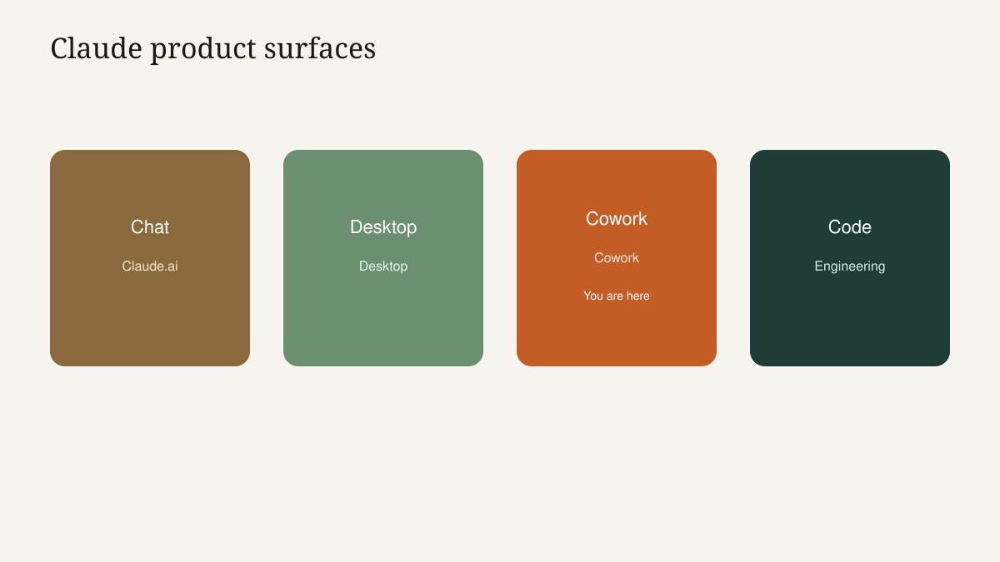

<!-- course-title: Claude Cowork Essentials -->

<!-- layout: title -->

Claude Cowork Essentials

# Chapter 3: Wins, Next Steps and Resources

---

# Chapter 3: Objectives

- Reframe wins as delegated time - work you hand off entirely, not only do faster
- Name one multi-step task to delegate to Cowork this week
- Leave with resources and a clear handoff to Claude Code for the right colleagues

---

<!-- layout: navigation -->
# Chapter 3

- **Delegated Time and ROI**
- Your Task This Week
- Resources and Wrap-up

---

# Faster versus Handed Off

- Chat and Desktop often make you faster at work you still own step-by-step
- Cowork aims at packets you supervise at plan gates instead of performing every hop
- ROI shows up as blocks of calendar returned - if your approval habits stay sharp
- Unsupervised messes are negative ROI dressed as automation

---

<!-- layout: 2-column -->
# Before versus After Today

### Before
- Five manual hops every Friday
- Deduping by eye
- Filing when you remember
- No written done state

### After
- One delegation brief
- Plan you can initial
- Scoped folder only
- Change log at the end

---

# Napkin Math (Keep It Honest)

- Friday pack: 45 minutes manual → 15 minutes supervise-and-verify
- That is ~30 minutes/week if the plan stays trustworthy
- First two runs may be slower while you learn approval judgment - that is tuition
- Measure after three sober runs, not after the demo high

---

<!-- layout: navigation -->
# Chapter 3

- Delegated Time and ROI
- **Your Task This Week**
- Resources and Wrap-up

---

# Reflection: Name One Multi-Step Task

- Write the outcome in one sentence
- List the steps you do today by hand
- Fill a Delegation Card: scope, approval mode, stop conditions, done when
- If you cannot name stop conditions, shrink the task

> [!NOTE]
> Two quiet minutes. Share task names only: not confidential folder trees.

---

# Delegation Card

| Field | Your notes |
| :--- | :--- |
| Outcome | |
| Scope (folders/connectors) | |
| Approval mode | |
| Stop conditions | |
| Done when | |

- Keep it with your other reusable workflow notes
- Promote a single-hop workflow to a Delegation Card when steps chain

---

# Day-7 Success Check

- I reviewed a plan before execution at least once on real work
- I rejected or edited a step when something felt fuzzy
- My scope stayed narrow on purpose
- I know whether my next pain is more Cowork - or actually Code for an engineer

---

<!-- layout: navigation -->
# Chapter 3

- Delegated Time and ROI
- Your Task This Week
- **Resources and Wrap-up**

---

# Where Cowork Fits Among Claude Surfaces

- **Claude.ai**: clear briefs and human review for everyday drafting
- **Claude Desktop**: Quick Entry and careful local connectors
- **Claude Cowork**: plan-approve-execute for multi-step packets
- **Claude Code**: engineering plan-approve-execute on real systems

---

# When to Loop In Engineering Partners

- Point developers, platform engineers and technical leads to Claude Code when the pain is software change
- Translate today's lesson for them: same approval culture, different artifacts
- Do not oversell Code to pure office delegates - it creates frustration
- Offer to co-define a problem statement with an engineering partner instead

---

# Leave-Behind Resources

- Approval-modes quick-reference (Manual / Always-allow / Auto-approve)
- Lab 2: Cowork Research and Report Sprint
- Official Cowork documentation (sandbox, connectors, computer use)
- Your completed Delegation Card from class

> [!TIP]
> Distribute the quick-reference before packing up begins.

---

# Day Recap

- Delegating changes the shape of work - not just the prompt length
- Plans are work orders; approval modes are trust dials
- Scope and injection awareness keep agents from outrunning judgment
- Browser control is powerful and uneven - steer it
- Code is next for builders; Cowork is enough for many office packets

---

<!-- layout: stacked -->
# Questions and Answers

