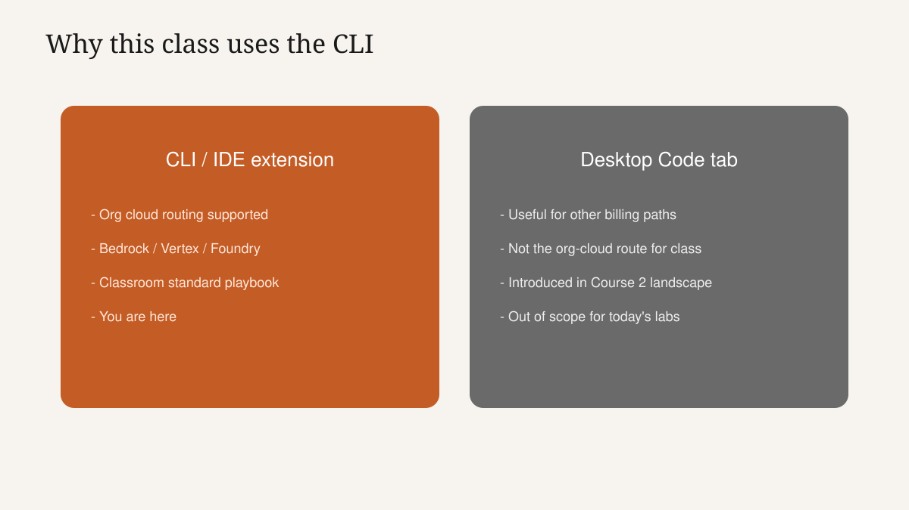
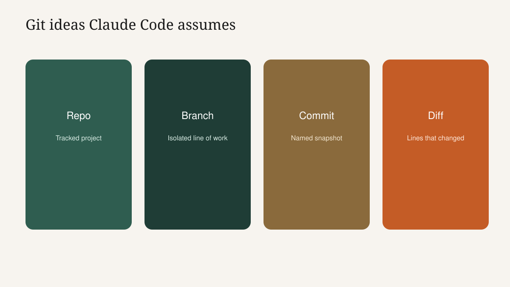
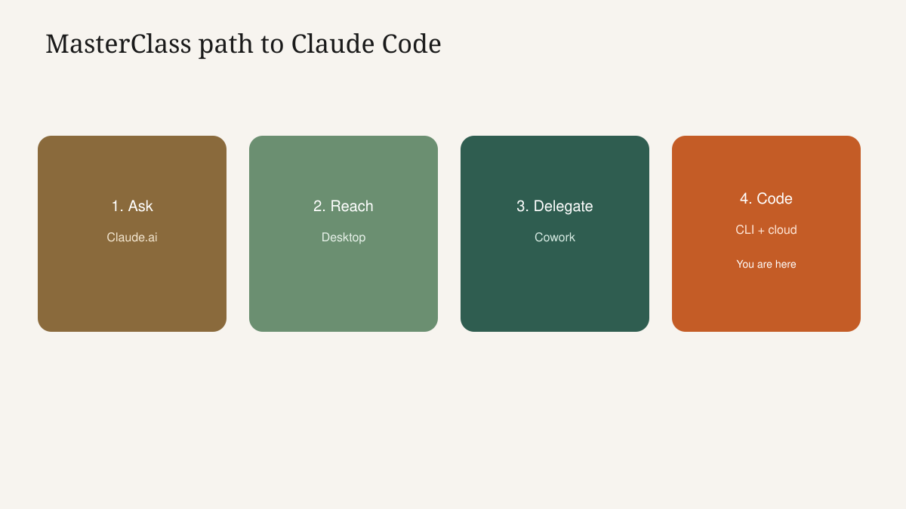
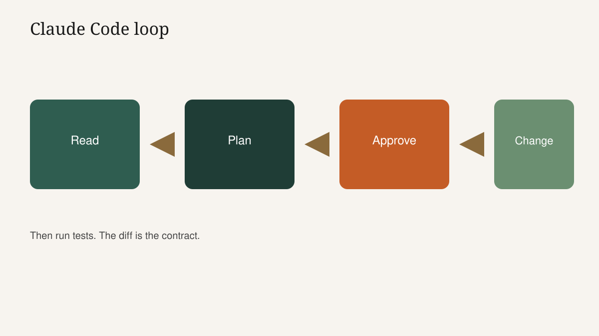
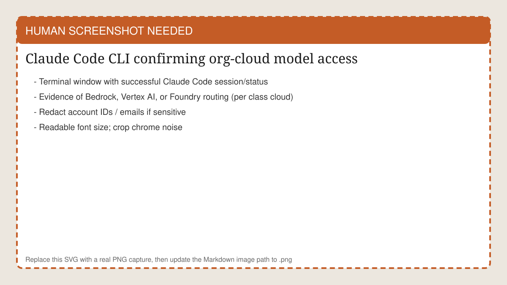
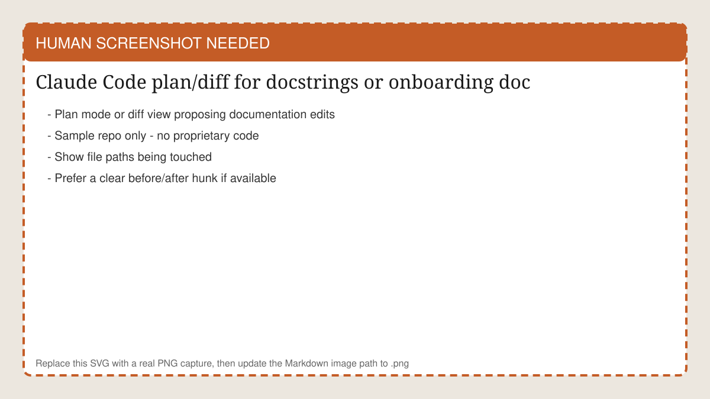

<!-- course-title: Claude Code Essentials -->

<!-- layout: title -->


Claude Code Essentials

# Chapter 1: CLI, Cloud and Your First Change

---

# Chapter 1: Objectives

- Use enough terminal and git fluency to follow Claude Code safely today
- Connect Claude Code through the organization's cloud path and explain the plan-approve-execute coding loop
- Explore an unfamiliar codebase and ship a small feature change via plan mode

---

<!-- layout: navigation -->
# Chapter 1

- **Command Line and Git Refresher**
- What Is Claude Code
- Cloud-Routed Setup
- Explore and Build

---

# Meet Alex (Jordan's Engineering Partner)

- Alex inherited a small internal tool with thin docs and a noisy backlog
- Jordan now delegates office packets with Cowork; Alex needs the same discipline on code
- Today's job: understand a module fast, then ship one small change without blind auto-accept
- Language-agnostic habits - the sample project carries the syntax

> [!NOTE]
> Plan-approve-execute discipline applies here too - today we apply it to real code.

<!-- ANTIGRAVITY / NANO BANANA
Filename: images/ch01-inherited-codebase.png (replace the SVG placeholder)
Slide: Meet Alex (Jordan's Engineering Partner)
Prompt advice:
- Developer at a terminal facing a maze of files that begins resolving into a clear path
- Hopeful technical illustration; warm light at the end of the maze
- 16:9; no proprietary code text; no horror/cyberpunk overload
-->


---

# Why the Terminal Today (Not Desktop Code Tab)

- This class routes models through your org cloud: Bedrock, Vertex AI or Microsoft Foundry
- That routing works in the **CLI and IDE extensions**, not the Claude Desktop Code tab
- Desktop Code remains useful for direct Anthropic billing outside this cloud-routed context
- We standardize on CLI so every student shares one playbook

> [!IMPORTANT]
> Confirm cloud model access and IAM/project/subscription setup at least one week before class.



---

# Terminal: The Five Moves You Need

- `pwd`: where am I?
- `ls` / `dir`: what is here?
- `cd`: move into the project folder
- Run a script or test command the README names
- Set or export an environment variable the cloud addendum requires

```bash
pwd
ls
cd my-sample-app
# then follow the project README for run/test commands
```

---

# Environment Variables Without the Panic

- Env vars are named settings your shell passes to programs (keys, regions, project IDs)
- Prefer the class addendum's exact names - do not invent alternate spellings
- Never paste long-lived secrets into the Claude Code prompt "so it can see them"
- If a var is missing, Claude Code fails loudly - that is better than silent wrong-account use

> [!WARNING]
> Chat history is the wrong secret store. Use shell env, SSO helpers or your org's approved secret path.

---

# Git: The Four Ideas Claude Code Assumes

- **Repository**: the project folder git is tracking
- **Branch**: an isolated line of work (use one for class changes)
- **Commit**: a snapshot you can name and undo toward
- **Diff**: the exact lines changed - your primary review surface



---

<!-- layout: 2-column -->
# Git Commands You Will Actually Touch

### Orient
- `git status`
- `git branch`
- `git diff`
- `git log -5 --oneline`

### Safe class habit
- Create a class branch first
- Review diffs before commit
- Prefer small commits
- Do not force-push shared main

---

# Enough: Not a Git Course

- Goal today: follow along, read a diff, not become a git historian
- If git frightens you, pair with a neighbor for the lab mechanics
- Claude Code is git-aware; you remain the merge authority
- Stuck? `git status` is the recovery compass

---

<!-- layout: navigation -->
# Chapter 1

- Command Line and Git Refresher
- **What Is Claude Code**
- Cloud-Routed Setup
- Explore and Build

---

# What Makes Claude Code Different

- Everyday chat: ask and refine text
- Desktop: reach Claude beside apps with local connectors
- Cowork: delegate multi-step work with plan gates
- Claude Code: an agent that reads code, edits files and runs commands - with the same gate culture



---

# Claude Code's Core Loop

- **Read** the codebase (and your brief)
- **Plan** the approach before risky edits
- **Change** files with your approval
- **Run** commands/tests you allow
- Repeat until the done state is true - or you stop the run



---

# Permission Modes That Matter Today

- **Manual approval**: confirm sensitive steps (commands, broad edits)
- **Plan mode**: investigate and propose while staying read-oriented before changes apply
- **Auto-accept edits**: faster on trusted, low-blast work - dangerous on auth, payments, IAM, migrations

> [!IMPORTANT]
> Lab rule: start in plan mode. Earn speed after you have read a clean diff.

---

<!-- layout: 3-column -->
# Mode Choice Cheat Sheet

### Plan mode
- Unfamiliar repo
- First approach
- Before any write

### Manual
- Commands that mutate
- Sensitive paths
- First feature of the day

### Auto-accept
- Tiny trusted edits
- After tests pass
- Never on secrets files

---

# What Claude Code Is Not

- Not a substitute for code review or CI
- Not permission to skip tests because the agent "looked confident"
- Not automatic production deploy
- Not a reason to paste `.env` contents into the prompt

---

<!-- layout: navigation -->
# Chapter 1

- Command Line and Git Refresher
- What Is Claude Code
- **Cloud-Routed Setup**
- Explore and Build

---

# Your Cloud, Your Controls

- Class path: Amazon Bedrock, Google Vertex AI or Microsoft Foundry - per org choice
- Follow the **Cloud Provider Setup addendum** for exact CLI flags, env vars and IAM roles
- Success check: Claude Code starts and can reach a model under the org account
- Wrong account or missing quota shows up as auth/model errors - fix early

<!-- HUMAN SCREENSHOT: Replace images/ch01-cli-cloud-connected.svg with a real PNG of Claude Code CLI showing successful org-cloud model access. Redact emails/account IDs. -->


---

# Demo: Verify the Room

1. Open the addendum for today's cloud
2. Students apply env/login steps
3. Run the addendum's "hello" prompt or `/status`-style check
4. Parking-lot auth failures immediately - do not debug twenty laptops mid-demo later
5. Confirm everyone is on the class model pin if the addendum specifies one

---

# Model Pinning: Pick a Known Version

- Teams standardize on a specific model version for reproducibility and change control
- Unpinned "default" can shift under you between Monday and Thursday
- Pin in config per addendum guidance; document the pin in the team README
- Changing pins is a deliberate upgrade - not a surprise mid-incident

> [!TIP]
> Write the pinned model ID on the whiteboard for the day. Ambiguity burns lab minutes.

---

<!-- layout: 2-column -->
# Why Org-Cloud Routing Matters

### Governance wins
- Billing lands in the cloud account you expect
- IAM and quotas follow existing controls
- Audit stories match enterprise practice

### Classroom wins
- One shared setup path
- IT can pre-approve access
- Desktop Code tab is optional later

---

<!-- layout: navigation -->
# Chapter 1

- Command Line and Git Refresher
- What Is Claude Code
- Cloud-Routed Setup
- **Explore and Build**

---

# Demo: Explain an Unfamiliar Module

- Hand Claude Code a sample repo nobody owns personally
- Ask: "Explain what `billing/calculator.py` (or equivalent) does for a new teammate."
- Require: public behavior, main functions, risks/ TODOs - not a line-by-line novel
- Show how a good brief beats "what is this codebase?"

```text
Plan mode. Explain the payment calculator module for a new engineer.
Include: inputs/outputs, failure modes, and where tests live.
Do not modify files yet. Flag anything that looks unsafe or unclear.
```

---

# Demo: Documentation That Survives Onboarding

- Ask for docstrings on one undocumented function plus a short `ONBOARDING.md` section
- Review the draft like a PR: wrong claims are worse than missing docs
- Accept only after spot-checking against the code
- This is ramp-time ROI - the quiet win for teams with legacy modules

<!-- HUMAN SCREENSHOT: Replace images/ch01-docs-plan.svg with a real PNG of Claude Code plan/diff proposing docstrings or ONBOARDING.md in the sample repo. -->


---

# From Understanding to a Small Feature

- Feature brief must be testable: "Add a `--json` flag that prints the summary as JSON"
- Start plan mode: approach, files touched, tests to run
- Approve file edits individually when unsure; batch only when the plan is boringly clear
- Run the project's test or run command before you celebrate

```text
Plan mode first. Add a --json flag to the CLI summary command.
Constraints: no dependency adds; update or add one test; keep existing flags working.
Show the plan and wait for approval before editing.
```

---

# Demo Build Script (Happy Path + One Rejection)

1. Create/checkout a class branch
2. Run explore prompt; leave plan mode
3. Run feature prompt; display the plan
4. Reject one over-broad step on purpose (e.g., "refactor unrelated modules")
5. Approve the narrow path; run tests
6. `git diff` on the projector - teach the diff as the truth surface

> [!IMPORTANT]
> Students should see you refuse scope creep. That refusal is the lesson.

---

# Lab Briefing: Build a Feature with Claude Code

- Sample project provided; class branch; plan mode first
- Propose → review → approve → apply → run the check command
- Checkpoint: one small working change you can demonstrate
- If cloud quotas throttle you, preserve the reviewed plan notes - the habit still counts

---

# Lab 1: Build a Feature with Claude Code

**Time:** 30 minutes

---

# What You Learned

- Used enough terminal and git fluency to follow Claude Code safely
- Connected through the organization's cloud path and applied plan-approve-execute to code
- Explored unfamiliar code and shipped a small feature change via plan mode

---

# Quiz 1 of 3

**Why does this class emphasize the Claude Code CLI (or IDE extension) over the Desktop Code tab?**

- A. The CLI is the only place Claude can read files
- B. Org cloud-provider routing (Bedrock, Vertex AI, Foundry) is supported in CLI/IDE extensions, not the Desktop Code tab
- C. The Desktop app cannot show diffs
- D. Git only works inside Desktop

---

# Quiz 1: Answer

**Why does this class emphasize the Claude Code CLI (or IDE extension) over the Desktop Code tab?**

**Correct: B.** Org cloud-provider routing (Bedrock, Vertex AI, Foundry) is supported in CLI/IDE extensions, not the Desktop Code tab

- Desktop Code still has uses outside this cloud-routed class path
- Governance and billing follow the org cloud account
- One classroom playbook beats mixed surfaces
- IDE extensions are allowed when they share the same routing story

---

# Quiz 2 of 3

**You are new to a repo and about to add a feature. What is the best opening move?**

- A. Enable auto-accept and ask Claude Code to "fix everything"
- B. Paste production secrets into the prompt for convenience
- C. Use plan mode to explain the relevant module and propose a narrow change plan before edits
- D. Delete the tests so they cannot fail

---

# Quiz 2: Answer

**You are new to a repo and about to add a feature. What is the best opening move?**

**Correct: C.** Use plan mode to explain the relevant module and propose a narrow change plan before edits

- Understanding before mutation
- Narrow plans are reviewable
- Auto-accept is earned later, if ever
- Secrets never belong in prompts

---

<!-- layout: 2-column -->
# Quiz 3 of 3: Discussion

### Prompt
Claude Code's plan for a "small flag" also rewrites auth middleware and upgrades three dependencies.

### Discuss
- What do you approve, edit or reject?
- What constraint would you add to the brief?
- How does `git diff` help you enforce the boundary?

---

<!-- layout: 2-column -->
# Quiz 3: Discussion Points

**Claude Code's plan for a "small flag" also rewrites auth middleware and upgrades three dependencies.**

### Strong Answers Mention
- Reject unrelated auth and dependency churn
- Re-brief: touch only CLI + one test; no dep adds
- Diff review catches scope creep the chat tone misses

### Watch For
- "While we're here" refactors on a deadline
- Approving because the plan sounds senior
- Skipping tests after a "simple" flag

---

<!-- layout: stacked -->
# Questions and Answers


