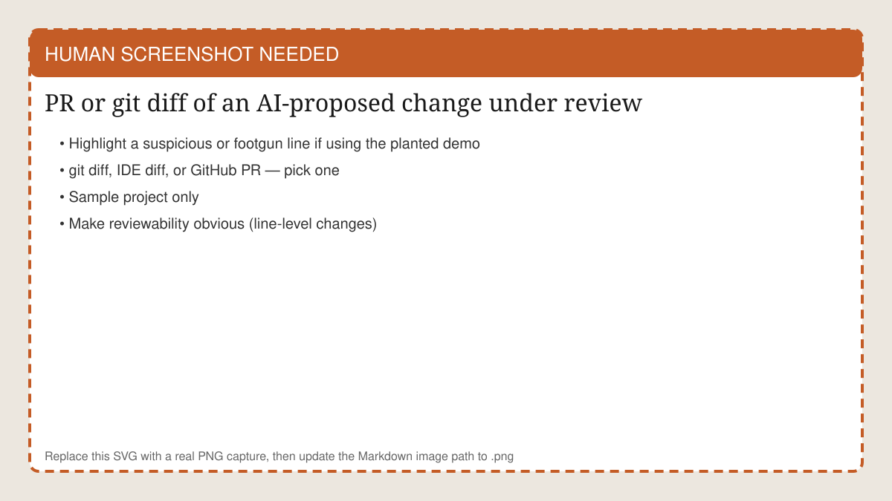
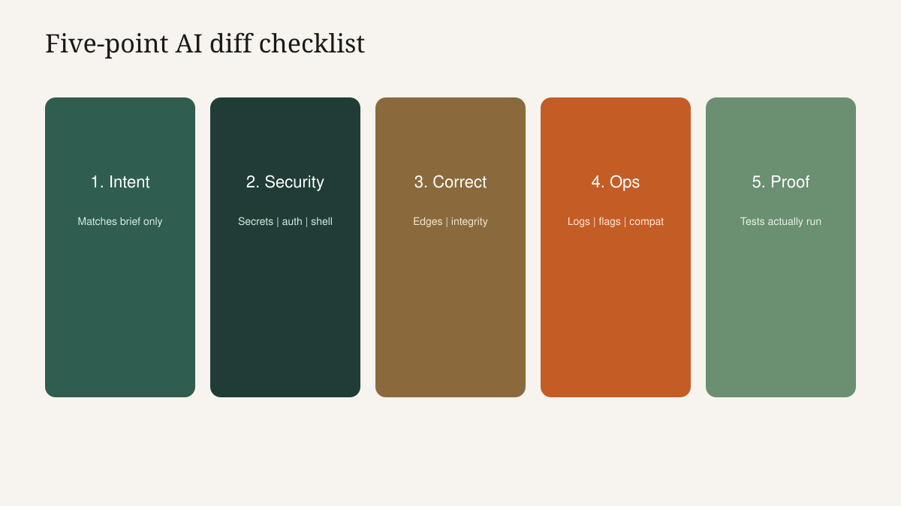
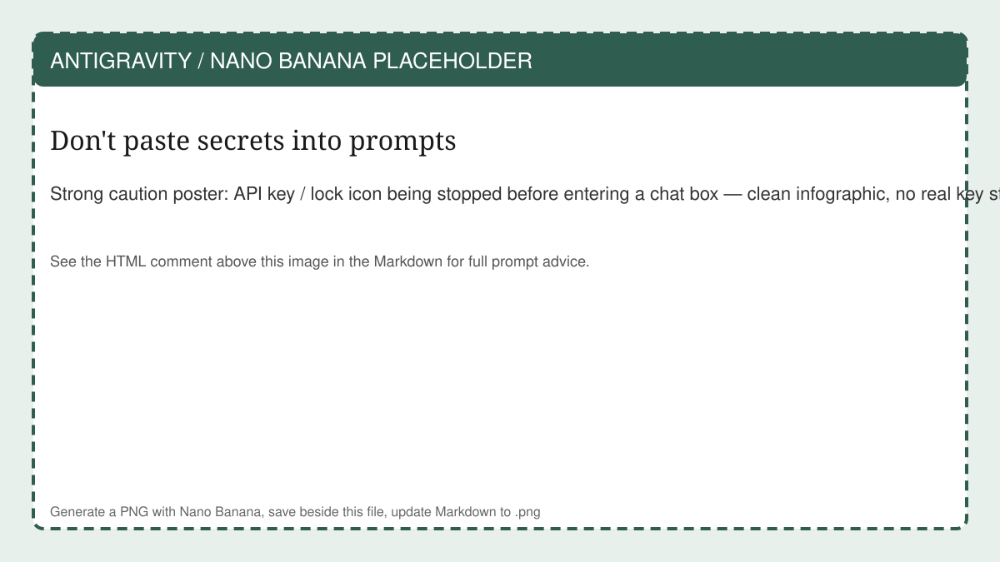
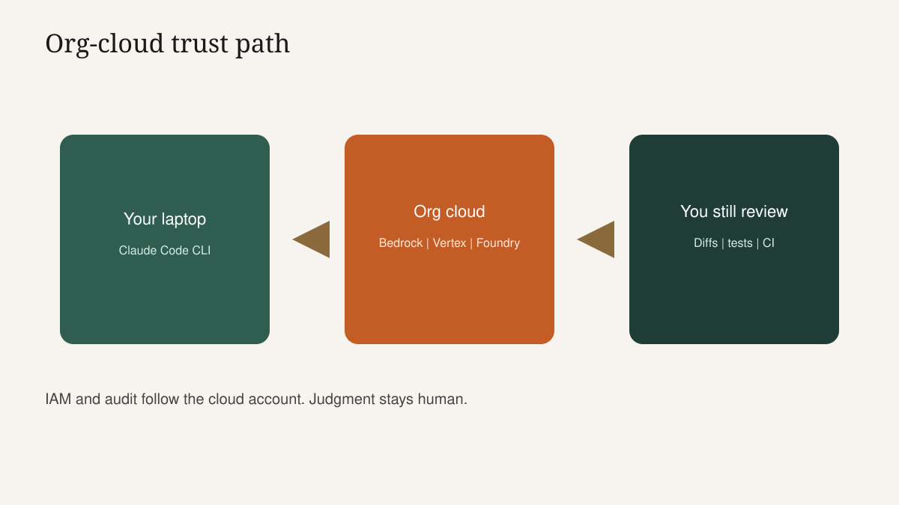
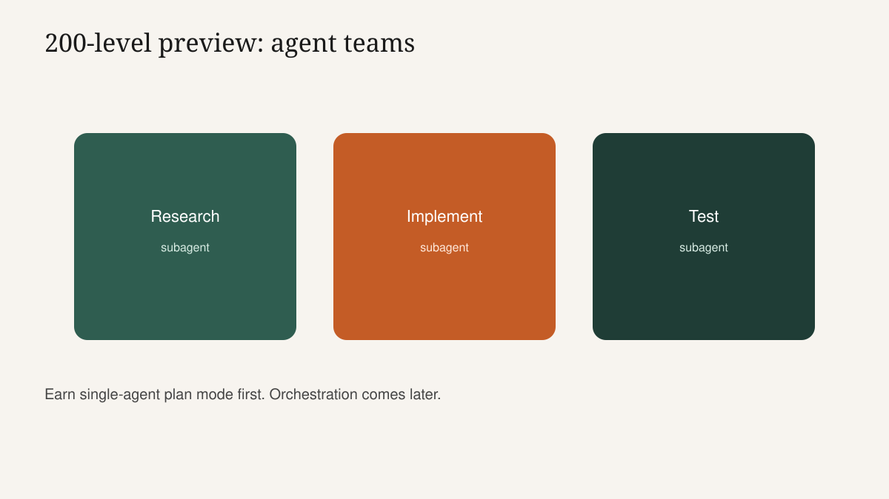

<!-- course-title: Claude Code Essentials -->

<!-- layout: title -->

Claude Code Essentials

# Chapter 2: Guardrails, Trust and What's Next

---

# Chapter 2: Objectives

- Review AI-generated code for security and correctness before merge
- Explain where prompts and code go under org-cloud routing and why human review remains the safety net
- Preview multi-agent 200-level workflows without overselling them for today

---

<!-- layout: navigation -->
# Chapter 2

- **Guardrails for AI-Generated Code**
- Trust in Your Cloud
- Agent Teams and What's Next

---

# The Diff Is the Product

- Chat explanations are marketing; `git diff` is the contract
- Read every changed path: auth, crypto, payments, IAM, migrations, lockfiles
- Ask: would I merge this if a junior human wrote it on Friday at 4:55?
- If not, do not merge it because Claude wrote it at 4:56

<!-- HUMAN SCREENSHOT: Replace images/ch02-diff-review.svg with a real PNG of a PR/git diff under review (plant a footgun in the demo branch if teaching the review drill). -->

---

# Instructor Demo: Review Before Merge

1. Show a drafted change that looks helpful but introduces a footgun (e.g., logging a token, weakened validation, broad `except`)
2. Walk a 5-point review checklist live
3. Ask Claude Code to fix only the footgun—not to "improve everything"
4. Re-read the new diff
5. Run tests again

> [!IMPORTANT]
> Plant one deliberate issue in the demo branch before class. Surprise findings teach better than perfect green paths.

---

<!-- layout: 2-column -->
# Safe Use versus High-Risk Use

### Safe patterns
- Plan mode first on unfamiliar code
- Scoped permissions / allowed paths
- Review before merge
- Tests green on your machine/CI

### High-risk patterns
- Blind auto-accept on sensitive files
- Secrets pasted into prompts
- Skipping review because demos looked good
- Force-pushing shared main

---

# Five-Point AI Diff Checklist

1. **Intent**: does the diff match the brief—and only the brief?
2. **Security**: secrets, injection, authZ, unsafe shell, path traversal
3. **Correctness**: edge cases, error handling, data integrity
4. **Operability**: logging noise, config flags, backward compatibility
5. **Proof**: tests added/updated and actually run

---

# Admin-Managed Policies

- Enterprise permission policies may block commands or paths locally—even if a developer wants auto-accept
- That is governance working, not the tool "being broken"
- Know who owns policy exceptions before class week emergencies
- Classroom may be looser than production; teach the production questions

> [!NOTE]
> Tie this to Course 3: always-allow and auto-approve were trust dials. On code, the blast radius includes production incidents.

---

# Secrets and Prompt Hygiene

- No API keys, tokens, private keys or connection strings in prompts
- Point Claude Code at files that are already gitignored only when policy allows—and still avoid printing secrets
- Rotate anything accidentally exposed; treat chat as exfil risk
- Prefer stub values in sample projects

<!-- ANTIGRAVITY / NANO BANANA
Filename: images/ch02-secrets-in-prompt.png (replace the SVG placeholder)
Slide: Secrets and Prompt Hygiene
Prompt advice:
- Strong caution poster: lock/API-key icon blocked before entering a chat prompt box
- Clean infographic; no real key strings; 16:9; high contrast for classroom projection
- Serious compliance tone, not meme comedy
-->

---

<!-- layout: navigation -->
# Chapter 2

- Guardrails for AI-Generated Code
- **Trust in Your Cloud**
- Agent Teams and What's Next

---

# Where Do Prompts and Code Go?

- With org-cloud routing, inference runs via your Bedrock / Vertex AI / Foundry path—not "mystery free tier"
- Exact logging, retention and training postures follow the provider + your org agreement
- Use the Cloud Provider Setup addendum's trust section for the class cloud's current facts
- Prefer official cloud and Anthropic docs over hallway claims

> [!TIP]
> Instructors: open the addendum trust page live. Fresh provider docs beat memorized slides.

---

# Audit and Governance Angle

- Cloud logs and IAM give security a story Desktop hobby setups often lack
- Know which identity Claude Code uses (user role vs shared lab role)
- Shared lab roles need tighter scopes and faster cleanup after class
- Human-in-the-loop review remains the real safety net—the permission dialog is necessary but not sufficient

---

<!-- layout: 2-column -->
# Permission Dialog versus Engineering Judgment

### Dialogs catch
- Explicit command approvals
- Some policy-denied actions
- Obvious high-risk tool calls

### You still catch
- Subtle logic bugs
- Insecure-but-allowed patterns
- Scope creep across files
- "Tests" that do not assert anything

---

# Same Ownership Sentence as Course 1

- "Claude decided" means "a human accepted a plan and a diff"
- CI and reviewers are teammates, not optional ceremony
- Agents accelerate; they do not absorb accountability
- Write that on the sticky next to Alex's backlog task

---

<!-- layout: navigation -->
# Chapter 2

- Guardrails for AI-Generated Code
- Trust in Your Cloud
- **Agent Teams and What's Next**

---

# Glimpse: Multi-Agent Engineering Workflows

- Subagents and parallel sessions can split research, implementation and test generation
- Powerful for larger tasks—easy to lose the plot without strong briefs and review
- This is **200-level territory**; today is the foundation those workflows sit on
- If single-agent plan mode still feels shaky, do not jump to agent teams yet

---

<!-- layout: 2-column -->
# Foundation versus Next Course

### You earned today
- CLI + cloud routing
- Plan mode discipline
- Diff-first review
- One shipped small change

### Save for 200-level
- Multi-agent orchestration
- Complex repo estates
- Advanced policy design
- Deeper IDE automation patterns

---

# Take-Home Lab Preview

- Refactoring and Test Generation: find a smell, refactor with Claude Code, generate a passing test suite
- Keep plan mode for the refactor approach; refuse unrelated cleanups
- Proof is tests passing—not a confident summary paragraph
- Bring one lesson to your team about review habits, not about "AI wrote it"

---

# Supplemental Lab (Take-Home): Refactoring and Test Generation

**Time:** 45–60 minutes (after class)

---

# What You Learned

- Reviewed AI-generated code for security and correctness before merge
- Explained org-cloud trust basics and kept human review as the safety net
- Previewed multi-agent workflows as 200-level next steps

---

# Quiz 1 of 3

**What is the strongest safety net when merging Claude Code changes?**

- A. The presence of any permission dialog during the session
- B. Auto-accept mode, because it implies the tool is confident
- C. Human diff review plus tests/CI, supported by scoped permissions and policy
- D. Pasting production secrets so Claude Code can "be thorough"

---

# Quiz 1 — Answer

**What is the strongest safety net when merging Claude Code changes?**

**Correct: C.** Human diff review plus tests/CI, supported by scoped permissions and policy

- Dialogs help; they do not replace judgment
- Diffs reveal scope creep and subtle bugs
- Tests/CI provide proof
- Secrets in prompts create new incidents

---

# Quiz 2 of 3

**Why route Claude Code through the organization's cloud account in this class?**

- A. Because Claude Code cannot run without three clouds at once
- B. So billing, IAM, quotas and audit practices follow enterprise controls the org already understands
- C. Because git remotes only work on Bedrock
- D. Because plan mode is disabled on direct Anthropic billing forever

---

# Quiz 2 — Answer

**Why route Claude Code through the organization's cloud account in this class?**

**Correct: B.** So billing, IAM, quotas and audit practices follow enterprise controls the org already understands

- Governance is the point of the routing choice
- CLI/IDE support that path; Desktop Code tab does not for this class design
- Addendum carries provider-specific steps
- Trust details still need current docs

---

<!-- layout: 2-column -->
# Quiz 3 of 3 — Discussion

### Prompt
Alex wants agent teams tomorrow to "rebuild the service" after today's half-day.

### Discuss
- What should Alex practice first for a week?
- What backlog task size fits tonight?
- When is a 200-level course the right next step?

---

<!-- layout: 2-column -->
# Quiz 3 — Discussion Points

**Alex wants agent teams tomorrow to "rebuild the service" after today's half-day.**

### Strong Answers Mention
- Repeat plan-mode small changes with clean diffs
- Pick a thin backlog slice with tests
- 200-level after foundations feel boringly reliable

### Watch For
- Boil-the-ocean rebuilds as week-one goals
- Skipping review because multi-agent "supervises itself"
- Confusing speed of demos with production readiness

---

<!-- layout: stacked -->
# Questions and Answers

