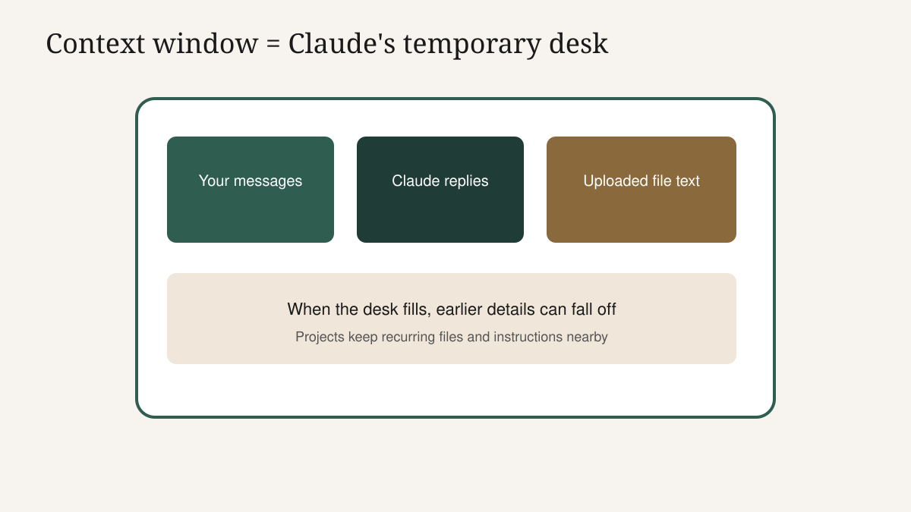
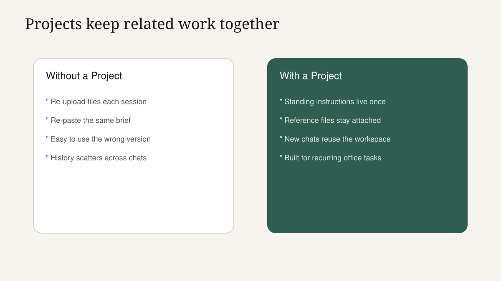
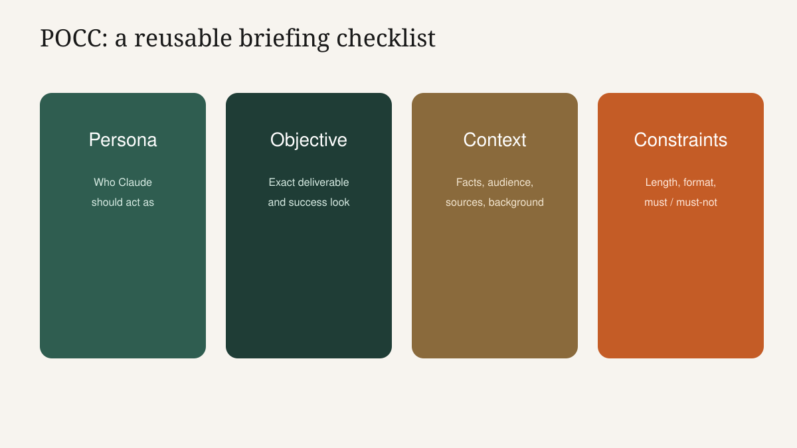

<!-- course-title: Claude.ai Essentials -->

<!-- layout: title -->


Claude.ai Essentials

# Chapter 1: From Chat Box to Clear Prompts

---

# Chapter 1: Objectives

- Explain tokens, context and why specific prompts save time and cost
- Navigate Claude.ai chat, Projects, uploads and chat history with confidence
- Rewrite a vague office request into a reusable POCC prompt

---

<!-- layout: navigation -->
# Chapter 1

- **How Generative AI Actually Works**
- Meet Claude.ai
- Prompting That Actually Works

---

# Today's Starting Point

- **Thesis**: Claude.ai is a daily business tool—not a novelty chat toy
- You leave with three reusable prompts and one clear MasterClass path
- No coding today; outcomes matter more than model internals
- Bookmark one real work task as we go; you will use it in the lab

> [!NOTE]
> This is Course 1 of 4 in the Claude MasterClass. Desktop, Cowork and Code come later for heavier work.

---

# What Generative AI Is Doing

- **Thesis**: The model predicts useful next text from patterns in language—not a search engine and not a database
- You supply intent; Claude supplies draft language, structure and options
- Quality rises when your request is specific about role, goal, context and limits
- Weak prompts force Claude to guess—and guessing looks confident even when wrong


---

# Tokens: The Unit Claude Counts

- **Thesis**: Claude reads and writes in tokens—small chunks of text—not whole documents at once
- A token is roughly a short word piece; longer prompts and replies use more tokens
- Token volume drives both response cost and how much fits in one conversation
- Specific prompts usually use fewer tokens than long, wandering chats that retry the same ask

---

<!-- layout: 2-column -->
# Tokens: What to Remember

### Think in chunks
- Words split into pieces
- Numbers and punctuation count too
- Uploaded files consume context

### Why you care
- Clear asks mean fewer retries
- Fewer retries mean less time and cost
- Context fills up; stay focused

---

# Context Window: The Working Desk

- **Thesis**: The context window is Claude's temporary desk for this chat—everything it can "see" right now
- Includes your messages, Claude's replies, and text extracted from uploaded files
- When the desk fills up, earlier details can drop out of reach
- Projects help by keeping related files and instructions in one workspace instead of pasting everything again



---

# Meaning as Numbers (Embeddings, Simply)

- **Thesis**: Related ideas sit near each other in a numeric map of meaning
- That is why Claude can connect "Q3 pipeline" with "sales forecast" even if wording differs
- You do not manage vectors yourself—specificity still helps Claude land near the right idea
- Vague asks scatter Claude across many nearby meanings; sharp asks narrow the neighborhood

> [!TIP]
> When results feel "off topic," add concrete nouns: system names, dates, audience and the exact deliverable format.

---

# Specificity Saves Time and Cost

- **Thesis**: Trial-and-error prompting is the expensive path
- Broad prompt → broad answer → many follow-ups → more tokens and more calendar time
- Structured prompt → usable first draft → light edits → done sooner
- Treat prompting like briefing a capable colleague: role, goal, facts and constraints up front

---

<!-- layout: 2-column -->
# Expensive versus Efficient

### Expensive pattern
- "Write something about the launch"
- Vague audience and tone
- Five clarifying chats

### Efficient pattern
- Role, audience, length, tone
- Facts Claude must use
- What to exclude

---

# Where Claude Fits Today

- **Thesis**: Claude is one strong option in a crowded generative AI landscape
- Strengths for office work: careful writing, long-document reasoning and structured follow-through
- Copilot and other tools may already sit in your Microsoft stack—overlap is normal
- Choose by task fit and policy, not by brand loyalty alone

> [!IMPORTANT]
> Your organization may restrict which AI tools and data classes are allowed. Follow policy first; techniques second.

---

<!-- layout: navigation -->
# Chapter 1

- How Generative AI Actually Works
- **Meet Claude.ai**
- Prompting That Actually Works

---

# The Claude.ai Workspace

- **Thesis**: Everything today happens in the Claude.ai web interface—no install required
- Core pieces: new chat, chat history, file uploads and account or privacy settings
- Treat chat history as a work log you can reopen, not a disposable scratch pad
- Privacy toggles and org settings matter—know what your seat allows before uploading files

<!-- TODO IMAGE: Screenshot of Claude.ai home chat workspace with new chat and history visible -->


---

# Chat, History and Uploads

- **Thesis**: A good Claude habit is one chat per task thread—not one endless mega-chat
- Start a new chat when the goal changes; reopen history when you continue the same task
- Upload files when Claude needs the source text; quote only snippets when the file cannot leave your desk
- Name chats clearly ("Q3 benefits FAQ draft") so next week's you can find them

> [!TIP]
> After a strong result, copy the winning prompt into a notes doc. That becomes your personal template library.

---

# Projects: A Workspace with Memory

- **Thesis**: A Project is a self-contained Claude workspace with its own knowledge for a team or recurring job
- Put standing instructions and reference files in the Project once
- New chats inside the Project reuse that context instead of re-uploading every session
- Use Projects for repeating work: policy Q and A, monthly report pack, onboarding FAQ



---

<!-- layout: 2-column -->
# Claude.ai versus Microsoft Copilot

### Claude.ai
- Strong for long documents and careful drafts
- Projects gather files for a recurring task
- Web chat first; Desktop and Cowork extend later

### Microsoft Copilot
- Lives inside Microsoft 365 apps many teams already use
- Convenient when Word, Outlook and Teams are the workbench
- Feature set and data path follow your Microsoft tenant

<!-- below-columns -->

> [!NOTE]
> Fair answer to "don't we already have this?": often yes for light in-app help. Claude.ai shines when the job is a multi-file brief, a careful rewrite, or a Project you return to weekly.

---

# The Claude Product Family

- **Thesis**: Claude.ai is the front door; heavier tools wait in later MasterClass sessions
- **Claude Desktop**: reach Claude from other apps and work with local files more safely at scale
- **Claude Cowork**: hand off multi-step tasks and review a plan before the agent acts
- **Claude Code**: plan-approve-execute coding changes tied to real cloud accounts


---

<!-- layout: navigation -->
# Chapter 1

- How Generative AI Actually Works
- Meet Claude.ai
- **Prompting That Actually Works**

---

# Vague versus Structured: Same Task

- **Thesis**: Structure beats clever wording
- Vague: "Help with the customer email"
- Structured: role, goal, customer context, tone, length and what not to promise
- Live demo: run both on the same scenario and compare usefulness of the first reply

> [!IMPORTANT]
> Instructors: use one office scenario end to end (email, summary, or meeting recap) so students see the gap immediately.

---

# The POCC Framework

- **Thesis**: Persona, Objective, Context, Constraints is a repeatable briefing checklist
- **Persona**: who Claude should act as (tone and expertise)
- **Objective**: the exact deliverable and success look
- **Context**: facts, audience, source material, background
- **Constraints**: length, format, must-include, must-avoid, due date



---

# POCC in Practice: Before

- **Vague office ask**: "Can you fix this email to the client about the delay?"
- Missing: who you are, what the delay is, what you can offer, tone, length
- Claude invents a polished message that may promise the wrong date or credit
- That "helpfulness" is the risk—not rudeness

---

# POCC in Practice: After

- **Persona**: Customer success lead; calm, accountable, no legalese
- **Objective**: 150-word email explaining a one-week ship slip and proposing a call
- **Context**: Order 4821; part shortage; new date Friday; customer is Acme Ops
- **Constraints**: Do not offer discounts; do not blame vendors by name; end with two time options

```text
Persona: You are a customer success lead. Tone: calm, accountable, plain language.
Objective: Draft a 150-word email about a one-week ship delay and propose a call.
Context: Order 4821; Acme Ops; part shortage; new ship date this Friday.
Constraints: No discounts. Do not name vendors. End with Tue 10:00 or Wed 14:00 options.
```

---

# Save It as a Personal Template

- **Thesis**: A winning prompt is an asset—treat it like a checklist, not a one-off
- Strip the one-time facts; keep Persona, Objective shape and Constraints
- Store templates by task: client delay email, meeting recap, exec summary
- Next time, fill Context slots only—minutes instead of a blank box

> [!TIP]
> Name templates with the outcome: "Meeting-recap-to-action-list" beats "Prompt 3."

---

# Lab 1: Prompt Writing Mastery

**Time:** 30 minutes

---

# What You Learned

- Explained tokens, context and why specific prompts save time and cost
- Navigated Claude.ai chat, Projects, uploads and chat history with confidence
- Rewrote a vague office request into a reusable POCC prompt

---

# Quiz 1 of 3

**Why do specific prompts usually cost less time and money than vague ones?**

- A. Specific prompts always use more tokens, which providers reward with free retries
- B. Vague prompts force more follow-up turns, so total tokens and calendar time rise
- C. Token billing only applies to uploaded files, never to chat text
- D. Claude ignores vague prompts, so you are not charged until the prompt is perfect

---

# Quiz 1 — Answer

**Why do specific prompts usually cost less time and money than vague ones?**

**Correct: B.** Vague prompts force more follow-up turns, so total tokens and calendar time rise

- Tokens measure text in and out across the whole thread
- Wandering chats burn tokens on clarification instead of the deliverable
- A clear first brief often yields an editable draft on turn one
- Efficiency is a business habit, not only a technical detail

---

# Quiz 2 of 3

**What is the main job of a Claude.ai Project for recurring office work?**

- A. It installs Claude on your laptop so chats work offline
- B. It permanently publishes your files to the public internet for collaboration
- C. It keeps standing instructions and reference files in one workspace you reopen
- D. It replaces your company's document management system and permissions model

---

# Quiz 2 — Answer

**What is the main job of a Claude.ai Project for recurring office work?**

**Correct: C.** It keeps standing instructions and reference files in one workspace you reopen

- Projects reduce re-upload and re-brief friction for repeating tasks
- They are still subject to your account and organization policies
- They do not remove the need for human review of outputs
- Desktop and Cowork extend local and multi-step work in later courses

---

<!-- layout: 2-column -->
# Quiz 3 of 3 — Discussion

### Prompt
A colleague pastes "rewrite this nicer" with a long email and no other guidance.

### Discuss
- Which POCC pieces are missing?
- What risks show up in the first draft?
- What minimum brief would you require before sending?

---

<!-- layout: 2-column -->
# Quiz 3 — Discussion Points

**A colleague pastes "rewrite this nicer" with a long email and no other guidance.**

### Strong Answers Mention
- Missing Persona, Objective detail and Constraints
- Risk of wrong promises, tone or confidential asides kept in
- Require audience, goal, must-keep facts and must-avoid lines

### Watch For
- "Claude will figure it out"
- Editing tone only while leaving factual errors untouched
- Sending without a human read because the draft "sounds right"

---

# Questions and Answers

Questions?
